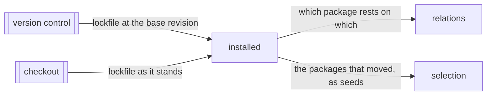

# Installed

«gateway»

## Responsibility

Reads the lockfile at two revisions and answers which packages the install
moved, tracing a transitive bump up to every package that rests on it.

## Bounded context

[Reach](../../DOMAIN.md#reach)

## Inputs and outputs

In: the text of one lockfile at each of two revisions, taken from the version
control object store rather than from the working tree alone. Out: the names of
the packages whose resolution differs between them, and — separately — which
package depends on which, so a bump reaches the packages that rest on it before
it reaches any file.

Names, never versions and never resolutions. Which copy of a package a resolver
handed a particular importer cannot be answered without reproducing that
resolver, so the answer is a set of names and over-includes by construction.

## Depends on

- [`version-control`](../../../externals/version-control.md) — the lockfile's
  text at the base revision, read as an object rather than as a changed path

## Used by

- [`relations`](../relations/README.md) — which package rests on which, folded
  in beside the file records so a package is a node like any other
- [`selection`](../selection/README.md) — the moved package names, as **seeds**

## Boundary

A lockfile is a **source read at two revisions, never a changed path**. The
distinction is the whole of this block: counted as a changed file it has no
record anywhere, so every workspace edit that rewrites it would widen the run,
and a resolution that changed what an unchanged line means would not widen it at
all. Compared as an install, a workspace-only rewrite yields nothing and a
silent resolution change yields a bump. The manifest is the same: `package.json`
is the request and the lockfile is the answer, and both paths drop out of the
changed-file list once the comparison is made, so neither is counted twice.

**A lockfile that cannot be read widens the run.** An unparseable file, an
unfamiliar layout, and a base revision that does not carry the file are all *the
comparison could not be made*, which is never *the comparison found nothing*.
Nothing here narrows on a guess about a format it does not recognise.

It resolves no specifier, opens no package directory and consults no installed
tree. Walking `node_modules` would answer a different question in every
installer — hoisting, workspace protocols, plug'n'play — and answer it wrongly
under most of them; the lockfile is the one artifact every installer writes down
its own answer in.

It decides nothing about which **subjects** run. It names what moved, and the
graph decides who cared.

## Implementation coordinates

- `packages/sense/src/lock/` — the readers, one per format, and the comparison
  between two reads
- `packages/sense/src/lock/yarn.ts`, `pnpm.ts`, `npm.ts` — the layouts, from a
  descriptor line to a name and a resolution
- `packages/sense/src/resolve.ts` — `packageOf`, the specifier a file wrote to
  the package name it asked for
- `packages/cli/src/commands/installed.ts` — the comparison as a command

## Diagram

