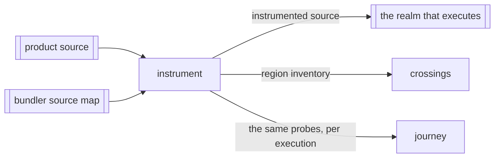

# Instrument

«factory»

## Responsibility

Cuts a module into arrival regions and splices a presence probe in front of each
one, producing the transformed source beside the inventory that says what every
region is.

## Bounded context

[Reach](../../DOMAIN.md#reach)

## Inputs and outputs

In: one module's source text, its id, and — where a bundler already transformed
it — the map that says which line of the original each offset was written on.
Out: the source with probes spliced in, and one entry per region carrying its
ordinal, its kind, its name and path, its extent in the author's own
coordinates, the digest of its own source with child bodies excluded, and the
ordinal of the region enclosing it. Also out: the identity of the exact input,
and the identity of the probe recipe.

## Depends on

Nothing in this block. It is a pure function of a string, with no disk, no
runner and no index.

## Used by

- [`crossings`](../crossings/README.md) — the inventory that gives an ordinal a
  name, a span and a digest
- [`journey`](../journey/README.md) — the same probes, resolved through a
  per-execution factory rather than a per-realm one

## Boundary

The rule is a single test: a region has exactly one arrival condition, and a
probe is placed only where control can diverge. Entering a `try` follows
from entering the region around it, so it gets nothing; entering its `catch`
does not, so it gets a probe. That test — *does reaching here follow from
reaching the enclosing region* — is the whole of the design. Short-circuiting
operators and ternaries belong to the region containing them: which branch ran is the fact
worth recording, and a change to either operand still reaches every test that
evaluated the condition.

A guard belongs to the region before its outcomes, so editing the guard moves
that region's digest while an edit inside one outcome does not.

Line count is preserved exactly — no inserted text contains a newline — so a
stack trace and anything else reading the same file still agree about lines.
Columns shift, and the extents recorded beside each region are translated back
through the bundler's own map, because a diff speaks in the coordinates of the
file the author edited and extents taken from transformed text are a different
number line rather than an approximation.

A module that cannot be parsed yields nothing at all, and a missing result is
never an empty region list: only the caller can keep those apart, and it widens
to the whole module. A probe stays in its instrumented realm — source
re-evaluated elsewhere has lost the generated declarations and throws at its
first probe, which makes an incomplete configuration visible rather than
silently dropping evidence.

## Implementation coordinates

- `packages/sense/src/instrument/index.ts` — `instrument`, the probe recipe
  identity, and the emitted runtime that re-resolves its counter array whenever
  the factory's identity moves
- `packages/sense/src/instrument/blocks.ts` — the region vocabulary, region
  identity, and where a module header may be inserted
- `packages/sense/src/instrument/walk.ts` — the descent that applies the arrival rule
- `packages/sense/src/test-selection/probes.ts` — the build-side plugin: probes in, inventory out
- `packages/sense/src/test-selection/source-lines.ts` — transformed offsets back to authored lines
- `packages/sense/src/test-selection/instrumented-modules.ts` — the inventory as
  it is persisted for a run that has not started yet

## Diagram

