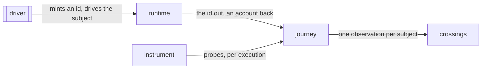

# Journey

«service»

## Responsibility

Carries a **journey** across every process its execution touches — one opaque
identity per execution, and afterwards the join of what each participant
reported under it — so that a path through two processes is one path.

## Bounded context

[Reach](../../DOMAIN.md#reach)

## Inputs and outputs

In: an id minted per attempt where the run begins and carried on the request;
inside each participant, the regions entered while a scope under that id is
open. Out: one account per **journey** per participant, and — joined in the
driver, which is the only party holding `journey → subject` — one observation
per **subject** covering every process it reached.

## Depends on

- [`instrument`](../instrument/README.md) — the probes, resolved through a
  factory whose identity moves per execution rather than per realm
- [`runtime`](../../runtime/README.md) — the carrier that takes the id out and
  brings an account back

## Used by

- [`crossings`](../crossings/README.md) — one row per **subject**, folded
  together with what the driven realm itself reported

## Boundary

A **journey** is bounded by its execution, never by a time window: one counter
set drained at request boundaries charges a **crossing** to whoever was open at
that moment rather than to the **subject** that caused it. The scope is logical instead, and it ends when
what the body returned settles rather than when the body returns, so the code
after an `await` is attributed.

The **subject**'s name never leaves the driver. A participant reports counts
under an id and writes nothing down; the driver mints, holds the mapping, and is
the only party that persists anything. Told neither which build it is part of
nor that anyone is listening, a participant installs nothing and the entry point
is the identity function, which is what lets the call ship to production rather
than be conditional on a build flag.

Every participant a run declares must report at least once. Silence does not
narrow: a declared participant that reported nothing all run, or one reporting a
different probe recipe, marks every observation in the run incomplete —
including the ones the driven realm observed perfectly — with a sentence saying
so. The **crossings** are still written and still queryable; what they lose is
the right to justify a skip. A run that was half-watched narrows nothing rather
than narrowing on the half that showed up, because *the participant executed
nothing* and *the participant was not watched* must never be confusable.

Traffic no **subject** claimed is counted apart rather than attributed — a
health check is not a **subject**. Regions belonging to a process rather than to
any one execution, such as a module's own initialization, are folded into every
**subject** the run drained rather than charged to whichever happened to be
first.

## Implementation coordinates

- `packages/sense/src/test-selection/journey.ts` — `collectJourneys`,
  `mintJourney`, and the per-execution factory behind the probe's global
- `packages/sense/src/test-selection/stitch.ts` — `stitchJourneys`, the driver's
  join, and the name unattributed regions report under
- `packages/cli/src/commands/journeys.ts` — the ground the joined observations become

## Diagram

