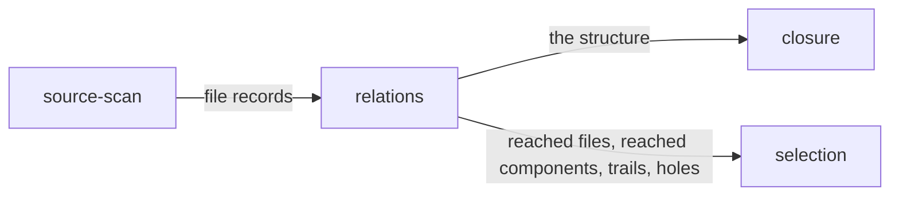

# Relations

«service»

## Responsibility

Holds what depends on what as one typed bidirectional structure, and walks it in
either direction with a trail that says how each node was arrived at.

## Bounded context

[Reach](../../DOMAIN.md#reach)

## Inputs and outputs

In: one record per file — its resolved edges, the components it declares, and
the sentence carried by any file whose edges could not be enumerated. Out: the
graph, and per traversal the set of nodes reached together with the chain that
reached each one.

## Depends on

- [`source-scan`](../source-scan/README.md) — the records it folds; it opens nothing itself

## Used by

- [`closure`](../closure/README.md) — the structure the digest is folded over
- [`selection`](../selection/README.md) — what a change reaches, and the chain
  that explains each arrival

## Boundary

One convention holds everywhere: `A → B` means A depends on B, so a change in B
may move A, and every question about what a change moved is a walk against the
arrows. Both directions are materialized, so *what depends on this* costs what
*what this depends on* costs. A component is an edge to the file that declares
it, in that direction, so one walk from a changed file reaches every importer
and every component.

It performs no I/O, opens no file and resolves no specifier. It distinguishes
edge kinds — a value import, a re-export, a dynamic import with a literal
specifier, a type-only import, a stylesheet or asset reference, a declaration —
because those explain a finding, and it still walks every kind by default:
narrowing on a kind is the caller's declaration rather than the default, because
the cost of being wrong is a green run over a surface nobody looked at.

A missed edge is a wrong answer, not a smaller one. A file whose edges are
unknown is marked as such and carries the reason, and the mark is a node
property so the sentence travels with the node rather than being reduced to a
count somewhere else. An empty record and an unreadable one are different facts
and are never folded together
([absent is not empty](../../DOMAIN.md#reach)). The graph never rules a **subject** out on its
own; it reports what it reached and what it could not read.

## Implementation coordinates

- `packages/core/src/relate/graph.ts` — node and edge kinds, interning, the
  compressed-sparse-row adjacency and its materialized transpose
- `packages/core/src/relate/reach.ts` — `dependentsOf`, `dependenciesOf`,
  `trailOf`; breadth-first from every seed at once, so the recorded parent lies
  on a shortest path and the printed explanation is the shortest true one
- `packages/core/src/relate/records.ts` — `relationsOfFiles`, `movedBy` and
  `explain`; the seed set is the changed files *and* every file whose edges are
  unknown

## Diagram

