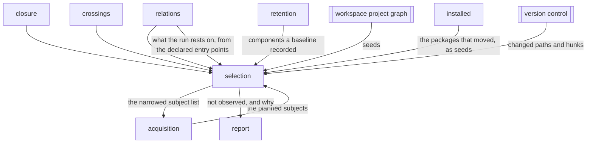

# Selection

«policy»

## Responsibility

Decides which **subjects** a run observes, from the structural ground and the
execution ground together, refusing to narrow at all whenever either ground
cannot answer.

## Bounded context

[Reach](../../DOMAIN.md#reach)

## Inputs and outputs

In: every **subject** the run planned; the paths a diff named and the hunks
behind them; the graph and what it reaches; the components each **baseline**
recorded; the execution record and what it says about the changed lines; the
packages an install comparison says moved; what the run rests on before any
test imports it, when entry points were declared; and the affected projects
another workspace tool answered with. Out: the narrowed **subject** list, the reason
each excluded **subject** was excluded, the
reachability trail for each reached component, and one note per ground that
declined to rule anything out.

## Depends on

- [`relations`](../relations/README.md) — what a diff reaches, and the chain
  that explains each arrival
- [`closure`](../closure/README.md) — the digest that decides sameness where a ref cannot be trusted
- [`installed`](../installed/README.md) — which packages the install moved
  between the two revisions, as **seeds**
- [`crossings`](../crossings/README.md) — which recorded observations entered a
  changed region, which were whole, and which changed files the record has
  nothing to say about
- [`retention`](../../retention/README.md) — the component names each
  **baseline** recorded, read from its sidecar
- [`acquisition`](../../acquisition/README.md) — the plan of **subjects** the
  narrowing subtracts from
- [`report`](../../report/README.md) — where a **not observed** entry and its
  reason are written down

## Used by

- [`acquisition`](../../acquisition/README.md) — the narrowed **subject** list to reach and read
- [`report`](../../report/README.md) — which **subjects** were not observed,
  why, and by which chain the rest were reached

## Boundary

Everything here is arranged to over-include, because the two mistakes are not
symmetric: a **subject** observed unnecessarily costs a collection, and a
**subject** skipped in error is a green run over an unwatched surface, produced
silently, since the **subject** is not in the report to be missing from. So a
**subject** with no **baseline** is observed, a **baseline** recording no
component list is observed, a changed source file declaring no component makes
the run whole, and a run that cannot list its changed files does not narrow.
When the diff cannot be computed at all the run is refused rather than widened,
because answering a broken query with an empty list would narrow a run to
nothing while reporting success.

Uncertainty widens toward observing more, and the two grounds only ever remove.
The structural ground answers what a change could have moved through the shape
of source; the execution ground removes further, from what the first ground
kept, on the evidence of which regions a **subject** was witnessed to enter — an
edit inside a handler no story fires is one two stories can be ruled out of, and
no reading of the file could have ruled them out. Running the second ground over
the whole plan instead would let a record made before a **subject** existed rule
out a **subject** the diff plainly reaches.

A **seed** is more changed input, never a second opinion and never a selection,
and there are two kinds. A package the install moved is the precise kind: it is
walked exactly as a changed file is, reaches only the files that import it, and
costs nothing where nothing imports it. What the install did *not* move costs
nothing either, which is why the lockfile is compared rather than counted as a
changed path — as a path it has no record and would widen every run that
rewrote it.

Other build tools contribute the coarse kind. Their answer is which projects a
diff affects, which is far coarser than a **subject**; every file under an
affected project is treated as though the diff named it and the graph narrows
from there. A failure
of such a tool is fatal rather than empty, because *this diff crosses no package
boundary* is a legitimate answer and must not be confusable with *the tool did
not run*.

An install that could not be compared — an unreadable lockfile, or a base
revision that does not carry it — does not narrow, for the reason a missing diff
does not: *nothing moved* and *nothing could be read* are the same empty list
and opposite facts. So is a moved package whose importers the execution record
never measured; it is named under the package's own name rather than a path,
because *no measurement of `@mui/material`* would otherwise read as a missing
file.

One question is asked before any walk and it can only refuse. What a run rests
on — the harness config, the setup it loads, the packages that environment is
built on — is imported by nothing, so a walk against the arrows from one arrives
nowhere and the honest structural answer is *no component moved*. That answer
would skip the whole suite over the file deciding how every test in it runs. A
diff wholly outside the graph already widened; the hole is a config edited
*beside* an ordinary source file, where the walk has a seed and answers
confidently about a change it never looked at. So when the diff moves one of
these, the run is whole and the sentence names the file or the package that put
it there.

Which paths govern a run is declared rather than derived. No rule can find them:
*every changed path the graph does not hold* is the README, the changelog and
the editor settings — a whole run each — and an operator who switched that off
would switch the configs off with it. What a declaration buys beyond its own
name is everything below it, which is why it requires a graph; a declared entry
the graph does not hold contributes only its own name, and that is the whole
answer for a node version or a CI workflow and a symptom for a harness config,
so it is reported as a note rather than guessed at.

Three states look identical from inside a walk and mean different things: a
changed file under the scanned roots that the graph does not hold; a diff no
part of which is in the graph; and a diff whose files reach no component at all,
which is also exactly what a changed file declaring a component the scan failed
to recognise looks like. Each returns its reason instead of an answer. There is
one walk, not two — the caller that narrows and the caller that explains read
the same call, because a run that skipped a **subject** for one reason and
printed another would be worse than one that printed nothing.

It states what it skipped; it does not decide what that costs. It never selects
individual test cases, except where the product owns the execution surface and a
single story is the unit of execution.

## Implementation coordinates

- `packages/cli/src/commands/affected.ts` — `affectedSubjects`, the structural
  ground and every refusal in it
- `packages/cli/src/commands/journey.ts` — `unenteredSubjects`, the execution
  ground and the difference between *the diff reached nobody* and *the record
  recorded nobody*
- `packages/cli/src/commands/reach.ts` — the single walk both the selector and
  the report read, and the refusal asked before it
- `packages/core/src/relate/before.ts` — what the run rests on, walked down from
  the declared entry points, and which of a diff's own inputs it covers
- `packages/cli/src/commands/run-select.ts` — the half with a disk and a
  subprocess: everything the narrowing needs, gathered once
- `packages/cli/src/commands/since.ts` — the diff against the merge base, and
  the join between the coordinates the version control names files in and the
  ones the run does
- `packages/cli/src/commands/changes.ts` — affected projects from a workspace tool, as **seeds**
- `packages/cli/src/commands/installed.ts` — the packages an install comparison
  says moved, as **seeds**
- `packages/sense/src/test-selection/importers.ts` — the same walk from a
  package seed, and the widening when an importer was never measured
- `packages/sense/src/test-selection/select.ts` — `selectTestFilesFromView` and
  `narrowByExecutionFromView`, the same rules over test files

## Diagram

