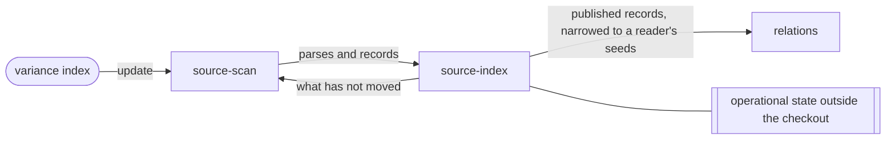

# Source index

«repository»

## Responsibility

Holds the checkout's published file records and parses: one step absorbs what
moved as a new layer, and every reader reads that generation instead of
scanning.

## Bounded context

[Reach](../../DOMAIN.md#reach)

## Inputs and outputs

In: the parses and records one update scanned from the whole checkout. Out: the
published records, narrowed to a reader's seeds; to the next update, what has
not moved.

## Depends on

- [`source-scan`](../source-scan/README.md) — the update is a scan of the whole
  checkout, whoever asks for it

## Used by

- [`source-scan`](../source-scan/README.md) — the parse and record caches that
  make an update cost the diff
- [`relations`](../relations/README.md) — the published records a selection
  folds into its graph

## Boundary

The scope is the checkout, never a reader's question: an index scoped to its
last caller is right for one reader at a time. A reader filters and never
updates on the way past, so it answers from the last publish.

A missing or damaged generation is refused in CI as an operator error naming the
step, and updated once anywhere else with a line saying so. Everything held is derived
from the checkout: parses keyed by content digest, records also by layout and
resolution settings, never by where the checkout sits. A lost generation costs
an update and cannot change what the update finds.

Every file the update answered is held, one it could not read as `unknown`: a
file missing from a generation reads as a file nobody has. A worktree's first
update starts from a copy of the primary checkout's generation, never a
reference to it, since the owner compacts and deletes its segments.

## Implementation coordinates

- `packages/sense/src/published.ts` — `updateSourceIndex`, `publishedSources`, `sourcesWithin`
- `packages/sense/src/source-index.ts` — `openSourceIndex`, the two caches and the append
- `packages/sense/src/immutable-log.ts` — the segment chain, and the copy a worktree starts from
- `packages/sense/src/cache.ts`, `packages/sense/src/reuse.ts` — the parse and record caches
- `packages/cli/src/commands/index-command.ts` — `variance index`, the publishing step
- `packages/cli/src/commands/source-graph.ts` — `relationsFor`, where every graph reader reads

## Diagram

