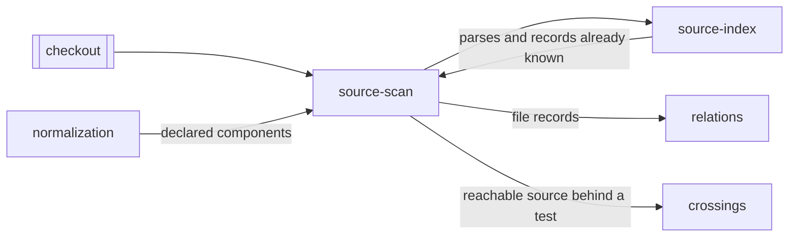

# Source scan

«gateway»

## Responsibility

Walks a checkout once and turns each file into a record of its resolved outgoing
edges, its content digest, and the components it declares.

## Bounded context

[Reach](../../DOMAIN.md#reach)

## Inputs and outputs

In: a repository root, the directories to seed from, the installed dependencies
and path mappings a specifier needs to resolve, and — when something already
knows them — a map of content digests. Out: one record per file, carrying
resolved edges, the digest the record was read from, the component names the
file declares, specifiers that resolved nowhere, and, when the file's edges
could not be enumerated at all, the sentence saying why.

Content digests come from the version control object store, so a file edited and
then edited back to its committed contents lands on its committed digest and
nothing runs for it.

## Depends on

- [`source-index`](../source-index/README.md) — the parse cache and the record
  cache that let an unchanged file cost two map lookups
- [`normalization`](../../normalization/README.md) — which component a source
  file declares, read from the same parse

## Used by

- [`relations`](../relations/README.md) — the records it folds into the graph,
  package edges among them
- [`crossings`](../crossings/README.md) — the statically reachable files behind
  a test file, for measuring how much of them a run entered

## Boundary

Configured directories are seeds and not a boundary: an imported stylesheet
outside them still enters the graph, because a scan that only knows the files it
was pointed at cannot answer the question it exists for. It stops at the
repository edge for *files* — a specifier resolving into a sibling package's
built output, or anywhere above the root, is dropped, since nothing in a diff of
this repository can be that file. That leaves a real gap at every package
boundary, and it is filled by [`selection`](../selection/README.md) taking
another tool's affected-project answer as more changed input.

A specifier that names an installed dependency does not vanish at that edge: it
is kept as an edge to the package under the name the source asked for, so a
package [`installed`](../installed/README.md) says moved reaches the files that
import it and no others. The name is the whole of what is recorded — no version,
no resolution, no directory.

It decides where a specifier points and never what counts as one; that is
settled from syntax alone. A specifier that resolves nowhere is still a fact
worth keeping, and *binds nothing* has several causes that must stay apart: a
bare specifier is recorded as a package edge whether or not anything is
installed under that name, since whether a package is present here decides
nothing about which files import it, while an unreadable or unresolved relative
edge means this file may depend on anything and carries the sentence saying so.

## Implementation coordinates

- `packages/sense/src/scan.ts` — `scanRelations`, the walk and the reuse ladder
- `packages/sense/src/read.ts` — `readModule` and `readStyle`, source text to specifiers
- `packages/sense/src/resolve.ts` — specifier to file, export conditions,
  `tsconfig` paths, and the case-folding checks that are invisible on a
  case-sensitive machine
- `packages/sense/src/tree.ts` — `gitDigests`, content digests without opening a file
- `packages/core/src/relate/records.ts` — the `FileRecord` shape the scan produces

## Diagram

