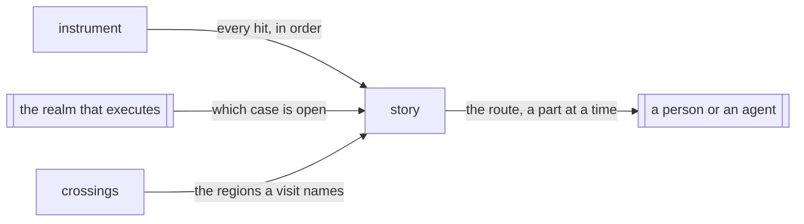

# Story

«service»

## Responsibility

Takes the order one test case visited instrumented source, when a run asks for
it, and reads it back as a **story**: a numbered route through declarations,
drawn at the finest level that fits a page and read a part at a time.

## Bounded context

[Reach](../../DOMAIN.md#reach)

## Inputs and outputs

In: every probe hit in one realm, in the order it happened, while a run asks for
stories; which case was open at each hit; and, to name what was visited, the
region inventory the record beside it holds. Out: one **story** per case,
written beside the record the run writes; read back, a route of numbered steps —
declarations with the arms taken in each, modules loaded along the way as one
step, a loop drawn once with how many times it went round — drawn by packages,
files, declarations, steps or every step, whichever is the finest that fits.

## Depends on

- [`instrument`](../instrument/README.md) — the probes, which report every hit
  to whatever stands behind their global, so order is taken without changing
  what the transform emits
- [`crossings`](../crossings/README.md) — the region inventory that turns a
  visited ordinal into a declaration with a name and a span

## Used by

Nothing in this block. A **story** is read by a person or an agent about to
change code a case goes through, and by nothing that selects or compares.

## Boundary

A **story** rides a **journey** and never alters it: the presence the run
records while a story is taken is byte for byte the presence it records
without one. It is written beside the record, never into it, and nothing that
selects or compares reads it. Which cases a story is taken for is the runner's
business; asking for stories takes one for every case the run runs.

It is a map, not a trace. The route is drawn at the grain of a declaration,
because the question is which parts of the system a case goes through and in
what order; the arms taken inside a declaration and how many times are carried
on its step, and the order of every visit inside it stays on the tape. A package
is the one its manifest says, never one computed from how the code is called. Steps are numbered and the number is the only join between
parts of a route: a visit is not a call, a function that returns leaves no
mark, so no step is drawn as another's parent.

What a **story** could not keep is said, not dropped: visits past its limit,
another case's work that ran inside this one, a case that threw. A module whose
regions the record does not hold at the text the story visited stays on the
route as its file and is named as unresolved; it is never matched to a region
by guess.

## Implementation coordinates

- `packages/sense/src/instrument/story-tap.cts` — the root that stands in front
  of the engine, tapes every hit and forwards it
- `packages/sense/src/test-selection/collectors.cts` — where a realm installs
  the tap instead of the engine, and writes each case's story as it settles
- `packages/sense/src/story/format.cts` — one case's story on disk
- `packages/sense/src/story/directory.ts` — the variable that asks for stories,
  and where they sit beside each record
- `packages/sense/src/story/read.ts` — a story named through the record beside
  it, drawn as a route
- `packages/sense/src/story/fold.ts` — tandem repeats folded, so a loop is drawn
  once
- `packages/cli/src/commands/story.ts` — `variance story`, the route as text or
  JSON
- `packages/cli/src/commands/story-view.ts` — the numbered route, the overview,
  and the windows through one file or package or around one step
- `packages/cli/src/commands/story-levels.ts` — the levels a part is drawn at,
  the one picked, and the packages passed through
- `packages/cli/src/package-home.ts` — the package a file is in, from the
  nearest manifest

## Diagram

