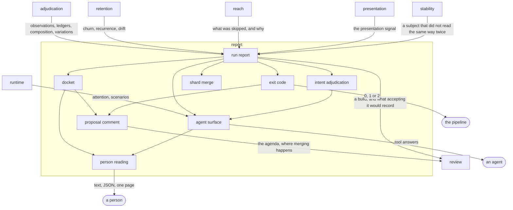

# Report

## Responsibility

Keeps the shape a run leaves behind — one versioned artifact carrying every
**subject**, its **verdict**, its **cause**, what was absorbed and what was
never looked at — and every reading taken of that artifact, for a person, for a
change proposal and for an agent.

## Logical role

This is where the system stops sensing and starts being read. Everything
upstream produces values in a process that then ends; this block is the durable
form those values take, so that the machine that observed and the reader that
acts can be different machines and still be looking at one account of one run.

## Boundary

It observes nothing and decides nothing: no reading here renders a **subject**,
re-runs a comparison, consults a **baseline**, opens a browser or reads a clock,
and no reading computes a **verdict**, promotes a **candidate** or records an
**approval**. It does not own the format it defines — neither the writer nor any
reader does — so a shape is admitted here only if it means the same thing to all
of them.

## Technology

TypeScript on Node. The artifact is JSON with an integer version and a
validating reader. The agent surface speaks JSON-RPC over stdio. The page is one
HTML file with its stylesheet and script inlined and no network access of any
kind. The change-proposal reading is GitHub-flavoured markdown carrying an
invisible marker.

## Implementation coordinates

- `packages/report/src/` — the format, its file, and the derivations that belong to it
- `packages/cli/src/commands/report.ts`, `report-html*.ts` — the readings for a person
- `packages/cli/src/commands/comment.ts`, `comment-blocks.ts`,
  `comment-text.ts`, `docket.ts` — the reading for a change proposal
- `packages/cli/src/commands/merge.ts`, `run-report.ts`, `adjudicate.ts`, `changelog.ts`
- `packages/cli/src/exit.ts` — the reading a pipeline takes
- `packages/mcp/src/`, `packages/help/src/` — the readings an agent takes

## Communicates with

- → [`review`](../review/README.md) — a build uploaded for decision, and the
  docket that is its agenda
- ← [`adjudication`](../adjudication/README.md) — observations, ledgers,
  composition and declared variations
- ← [`retention`](../retention/README.md) — churn, recurrence, drift and the changelog
- ← [`reach`](../reach/README.md) — which subjects were not observed, and why
- ← [`presentation`](../presentation/README.md) — the presentation signal
- ← [`stability`](../stability/README.md) — that a subject did not read the same way twice
- ← [`runtime`](../runtime/README.md) — a suite in flight, attention journals and scenario evidence

## Uses

### [Review](../review/README.md)

#### Why

Reading and deciding are two **capabilities** and must never be one. This block
can state what there is to decide and can put that statement where deciding is
cheap; it cannot hold a named person's decision. The moment the surface that
renders the agenda is also the surface that records the answer, the format
starts bending towards whichever answer is easier to render. So the agenda
travels and the decision lives elsewhere.

#### What I need from it

A place that accepts a **build** under a write credential and refuses to decide
it with the same one; an artifact whose **cause** attribution survives the trip
intact, so that the fold a hosted surface performs on arrival is over the same
attributed causes this block folds locally rather than over a list of images to
be re-grouped; and a decision, once made, recorded against a **subject** and a
run so the **changelog** entry this block derives has something durable to
attach to.

#### What would make me leave

A review surface that re-derived causes from the images it was handed rather
than from the attribution the artifact carries. Two folds over one run disagree,
and the day they do, a reviewer and a pull request are reading different
accounts of the same evidence with no way to tell which one was fixed.

## Components

| Component | Responsibility |
|---|---|
| [run report](./run-report/README.md) | Defines the versioned artifact a run writes, and the derivations that belong to the format rather than to any reader |
| [docket](./docket/README.md) | Folds a run into the review items a person can act on: causes named, collateral counted |
| [exit code](./exit-code/README.md) | Says in one integer whether anything needs review, keeping a verdict about the product off the channel a crash uses |
| [shard merge](./shard-merge/README.md) | Folds N partial runs into one artifact, or refuses by name, promoting any subject every shard excluded to a failure |
| [person reading](./person-reading/README.md) | Renders the artifact for a person, at a terminal and as one self-contained page |
| [proposal comment](./proposal-comment/README.md) | Renders the docket as one comment on a change proposal, found by a marker and rewritten in place |
| [agent surface](./agent-surface/README.md) | Serves evidence to an agent as a set of tools that read and never act |
| [intent adjudication](./intent-adjudication/README.md) | Reads a run back against what its author declared they were changing |
| `packages/cli/src/commands/report-html-{style,script,elements}.ts` | L5 — the page's inline stylesheet, its comparison script, and the escaping primitives every block writes through |
| `packages/report/src/changelog-message.ts` | L5 — the codec a changelog record round-trips through on its way into and out of a commit message |
| `packages/mcp/src/server.ts`, `packages/mcp/src/protocol.ts`, `packages/help/src/server.ts` | L5 — request framing and stdio transport, holding no decision |

## Diagram

