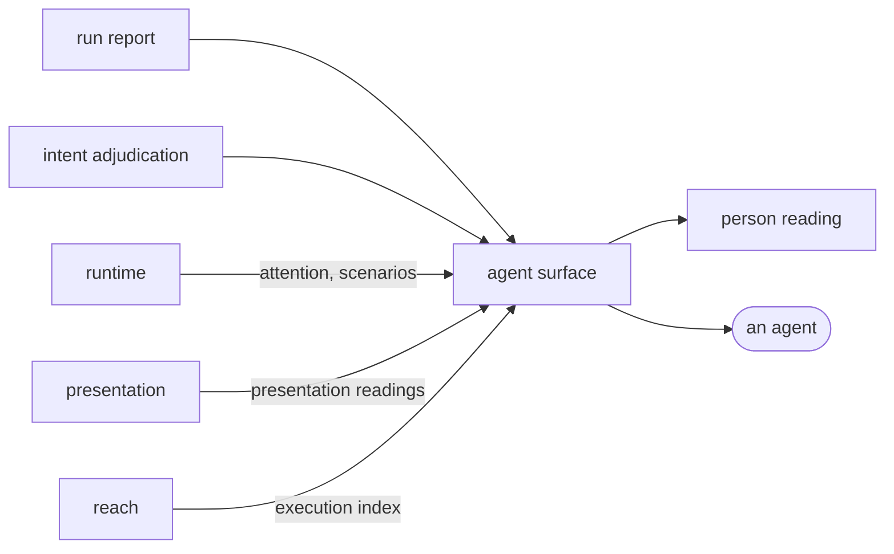

# Agent surface

«gateway»

## Responsibility

Answers an agent's questions about evidence somebody else produced, as a set of
tools that read and never act.

## Bounded context

[Report](../../DOMAIN.md#report)

## Inputs and outputs

In: whatever was already read — the run artifact, a live suite held in a
watching process, **attention** journals and **scenario** evidence from
[`runtime`](../../runtime/README.md), presentation readings from
[`presentation`](../../presentation/README.md), the execution index from
[`reach`](../../reach/README.md), and a workspace's published names — supplied
per request so an agent that has just re-run is answered from the new evidence
rather than the one loaded at start-up.

Out: a paragraph per question, in the sentence a person would want, with a file
path on the end. Plus the tool listing itself, in the order an agent meets the
tools in, and whatever a client needs told before it has called anything.

## Depends on

- [`run report`](../run-report/README.md) — the subject every report tool answers about
- [`intent adjudication`](../intent-adjudication/README.md) — the one tool that
  takes an agent's own account in

## Used by

- [`person reading`](../person-reading/README.md) — the same answers, printed at a terminal

## Boundary

A tool exposes evidence and does nothing else. None of them runs a test,
rerenders a **subject**, changes a **baseline**, or infers evidence that is not
there: a missing field is a tool error rather than an empty subject, because
answering about a domain nobody supplied would invent the one fact the answer
exists to carry. Every answer is a pure function from something already read to
text, separately from the framing, so the only question worth asking about one —
*does this help an agent fix the thing?* — stays cheap to ask.

It holds exactly one prior invocation, in memory, and calls it that. Comparing
the current state with the one held from the previous call is a session question
about a process that is still running; it is not a record, it survives nothing,
and the first call says so rather than answering with an empty difference.

The ordering is the design. The listing tool comes first because every other
tool takes an argument it printed; the tool that groups a run into decisions
comes early because an agent walking a run's changed subjects one at a time
spends a call on each to learn what one call says. The tools that answer about
the suite come before the ones that narrow to a subject, and the tool that
previews what accepting would record comes last, because an agent that has not
read what changed has no shape to ask about.

It owns no format. The artifact it reads is defined elsewhere precisely so that
a format with several readers does not bend towards this one.

The same contract serves a second subject that is not a run at all: a
workspace's published names, ranked by how many packages import each one,
answering what a name is, where it is declared, what its signature is and who
reaches for it. It re-reads on every request, because the agent asking is the
agent that just edited the file, and a workspace caught mid-edit leaves the
previous reading standing — stale rather than wrong.

## Implementation coordinates

- `packages/mcp/src/tools/tool.ts` — `Tool`, `Served`, `ToolInvocation`, `stringArg`
- `packages/mcp/src/tools.ts` — the sets, their order, and the lift that puts
  several subjects behind one connection
- `packages/mcp/src/tools/` — one module per answer
- `packages/mcp/src/tools/diff.ts` — the one stateful tool, and the single prior invocation it holds
- `packages/help/src/tools.ts`, `packages/help/src/tools/` — the five questions asked of a workspace

## Diagram

