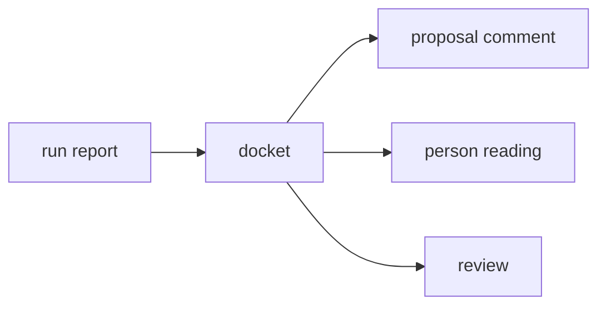

# Docket

«service»

## Responsibility

Folds a run into the review items a person can act on: one entry per **cause**,
everywhere it is the cause, with everything that moved because of it counted and
listed nowhere.

## Bounded context

[Review](../../DOMAIN.md#review)

## Inputs and outputs

In: the artifact, from [`run report`](../run-report/README.md).

Out: causes keyed by component rather than by **subject**, each carrying the
files, the places and the subjects it was named in; a **cluster** of collateral
reduced to counts, including the regions the run itself found and chose not to
record; the subjects with a **verdict** but no region to point at, grouped by
the reason; the count of observations a person actually has to decide about; and
the subjects nobody looked at.

## Depends on

- [`run report`](../run-report/README.md) — observations, regions, the **not observed** list

## Used by

- [`proposal comment`](../proposal-comment/README.md) — the agenda it renders
- [`person reading`](../person-reading/README.md) — the same agenda, on a page
- [`review`](../../review/README.md) — the same fold, performed there over the
  causes this artifact attributed; this fold serves the local path

## Boundary

It produces no character of output, which is what lets the fold be asserted on
as counts and lets the prose change without any of these decisions moving. It
never ranks by [area](../../DOMAIN.md#cause), and at suite scale it does not
rank by incidence either: collateral subjects outnumber the one changed
component and win every list they are let into. It keeps two claims apart that a
renderer would merge: *this is the edit* and *this is the largest thing that
moved* is a count rather than a flag, and *nothing changed* is never written in
the voice of *nothing was looked at*. Both green verdicts are excluded from what
needs deciding, because **ignored** is a decision the operator already made.

## Implementation coordinates

- `packages/cli/src/commands/docket.ts` — `docketOf`, `CauseEntry`, `Collateral`, `Group`, `Docket`

## Diagram

