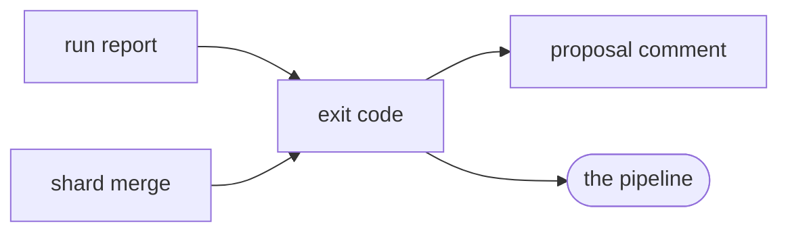

# Exit code

«policy»

## Responsibility

Reduces a run to the one integer a pipeline reads, keeping *nothing needs
review*, *the product needs a decision* and *the run did not happen as
configured* on three separate channels.

## Bounded context

[Report](../../DOMAIN.md#report)

## Inputs and outputs

In: the verdicts, the diagnostics each observation carried, whether a **second
reading** disagreed and whether the **subject**'s own declaration absorbed it,
and the **not observed** list — read as a structural shape rather than as an
imported type, so the module that decides the integer has no dependency at all.

Out: `0`, `1` or `2`, and the marker a third-party collector sets on an error to
claim the third of them.

## Depends on

- [`run report`](../run-report/README.md) — the fields above, and nothing else

## Used by

- [`proposal comment`](../proposal-comment/README.md) — the single decision
  about whether a comment exists at all
- [`shard merge`](../shard-merge/README.md) — the gate a promoted coverage hole is promoted *into*

## Boundary

A **verdict** about the product and a crash of the machine never share a code,
and a run that did not happen is never reportable as a run that found nothing: a
missing coverage list is an open question rather than a clean one ([absent is
not empty](../../DOMAIN.md#run-report)), so `2` is never produced by a finding
and `1` is never produced by a failure.

A `failed` entry holds the run open; an **ignored** verdict, an `excluded`
entry, a `warn` diagnostic and an **instability** every band of which fell
outside what the subject asserts on do not, because each is a decision the
operator already made.

## Implementation coordinates

- `packages/cli/src/exit.ts` — `EXIT_CLEAN`, `EXIT_REVIEW`, `EXIT_OPERATOR`,
  `exitFor`, `OperatorError`, `OPERATOR_ERROR_MARKER`, `isOperatorError`; its
  header carries the argument for three integers rather than two, and what each
  collapse costs

## Diagram

