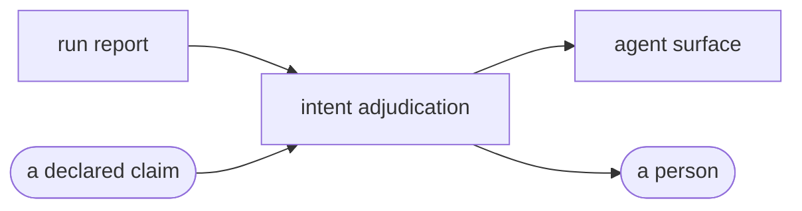

# Intent adjudication

«policy»

## Responsibility

Reads a run back against the claims its author declared before making the
change, and say which were delivered, which moved nothing, and what moved that
no claim covers.

## Bounded context

[Report](../../DOMAIN.md#report)

## Inputs and outputs

In: the artifact, and a declaration that arrived from outside it — a root, a
reason and a bound, one per claim.

Out: three arms. Delivered, where the change happened where it was declared.
Unclaimed, where something moved that no claim covers. Undelivered, where a
claim matched nothing — and, where the run kept a census of what it rendered,
which of the two undelivered readings applies: the component was rendered and
did not move, or it was never rendered and nothing here is evidence about it.

## Depends on

- [`run report`](../run-report/README.md) — the **cluster**s a claim is matched
  against, the census that separates the two undelivered readings, and the
  coverage list

## Used by

- [`agent surface`](../agent-surface/README.md) — the one tool that takes an agent's own account in

## Boundary

It changes no **verdict**, gates nothing, and never touches a **baseline**. It
never derives a claim: a claim read out of the diff is not a claim, and taking
the declaration as an input is what keeps the adjudication from scoring the run
against itself. Over-claiming is visible by construction rather than by policy,
because a claim that matched nothing is reported rather than absorbed — an agent
that claims everything so nothing can be unclaimed walks into the third arm.

It is not part of a run. A declaration is a property of a change and not of the
run that observed it: the same artifact is adjudicated differently by the agent
that wrote the branch and by a reviewer who did not, and folding claims into the
run would make an exit code depend on who was asking and let an unread
declaration silently authorize whatever it happened to match. The author's
sentence carried in the artifact is a different thing — it is printed by every
surface and matched against nothing, because a sentence cannot be matched.

The third arm is the one nothing else here can reach. A run with no difference
and a run where the edit never executed produce the same picture, and nothing
comparing two images can separate them.

## Implementation coordinates

- `packages/report/src/intent.ts` — `adjudicateRun`, `describeAdjudication`,
  `parseRoot`, `Claim`, `ClaimOutcome`, `UnclaimedChange`
- `packages/cli/src/commands/adjudicate.ts` — the declaration read from a file beside the run
- `packages/mcp/src/tools/adjudicate.ts` — the tool an agent calls before it
  asks anything else about its own edit

## Diagram

