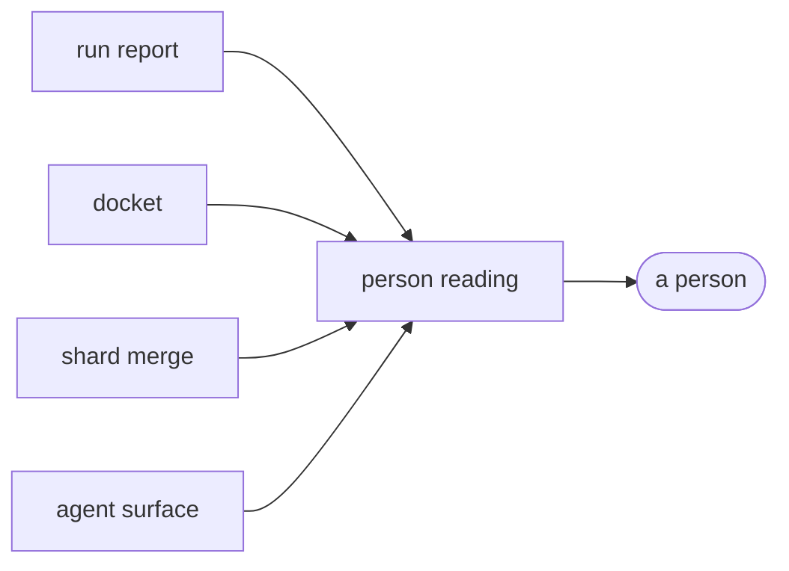

# Person reading

«handler»

## Responsibility

Renders the artifact for a person — as text or JSON at a terminal, and as one
self-contained page — without deriving anything the artifact does not already
say.

## Bounded context

[Report](../../DOMAIN.md#report)

## Inputs and outputs

In: the artifact, and optionally one **subject** by name.

Out: text answers, a JSON document that round-trips, or a single HTML file with
its stylesheet and its comparison script inline and the images beside it,
referenced exactly as the artifact declares them.

## Depends on

- [`run report`](../run-report/README.md) — everything it prints, including the
  stabilization recipe, the ledgers and the warnings that belong to no subject
- [`agent surface`](../agent-surface/README.md) — the text answers themselves,
  called rather than reimplemented
- [`docket`](../docket/README.md) — causes and collateral on the page
- [`shard merge`](../shard-merge/README.md) — the suite-level artifact when the run was split

## Used by

Nobody in this block. A person is the terminal reader.

## Boundary

It never re-runs. A command that observed afresh would give an answer that
depends on the machine asking, and rasterization is machine-bound — so *why did
this component change*, asked from a laptop about a run pinned to a container,
is a different question with a different answer and nothing in the output would
say so. A reading can be stale and this cannot tell, so every answer is prefaced
by the run's own timestamp and **renderer identity**.

It adds no second opinion. The text answers are the agent surface's answers,
called by name, because two formatters over one artifact drift and the day they
do a person and an agent disagree about what one run found with no way to tell
which of them is reading the surface that was fixed. What is added on top is
only what the agent's type cannot see: the index warnings belonging to no
subject, and the ledgers that are facts about a configuration rather than about
a run.

The page refuses a per-subject filter. Narrowing the text or the JSON answers a
question about one subject; narrowing a *page* produces something that says
nothing about coverage while looking like a complete run that found one thing,
and the reader of a page has no prompt to type the unnarrowed command in — so it
is refused by name rather than honoured or ignored. The page fetches nothing.

Nothing is dropped to make room. A qualification a returning reader has already
read is compressed into a marker with the long form kept where a first-time
reader finds it, and a filtered JSON document states what the filter removed and
how much of it there was.

## Implementation coordinates

- `packages/cli/src/commands/report.ts` — `formatReport`, and the one narrowing `asHtml` refuses
- `packages/cli/src/commands/report-html.ts` — `reportHtml`
- `packages/cli/src/commands/report-html-{subjects,composition,coverage,settled}.ts` — the panels
- `packages/cli/src/commands/{ignores,sensitivities}.ts` — the ledger paragraphs

## Diagram

