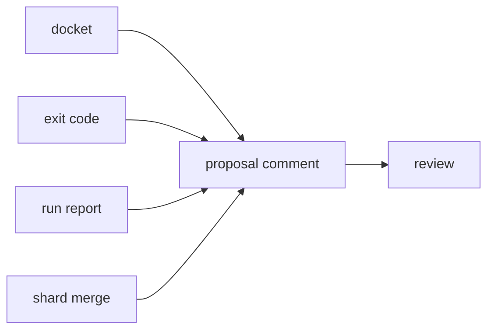

# Proposal comment

«handler»

## Responsibility

Renders the **docket** as one comment on a change proposal, found by a marker in
its own body and rewritten in place.

## Bounded context

[Report](../../DOMAIN.md#report)

## Inputs and outputs

In: the artifact, the limits each list stops at, and optionally where the full
report and the images were published.

Out: a markdown body leading with **drift**, then causes, then what has no
cause, then coverage — or the empty string.

## Depends on

- [`docket`](../docket/README.md) — the causes it lists and the collateral it counts
- [`exit code`](../exit-code/README.md) — the single decision about whether a comment exists
- [`run report`](../run-report/README.md) — the drift rows, the coverage list and the warnings
- [`shard merge`](../shard-merge/README.md) — the one artifact a sharded suite comments about

## Used by

- [`review`](../../review/README.md) — the agenda, delivered where acting on it is cheap

## Boundary

It is read in a hurry by somebody who came to merge, so every line spent on
something they cannot act on is a line spent making them stop reading. It leads
with **cause**s and counts collateral: one token change reaching three hundred
**subject**s is one item with the number beside it, never three hundred lines —
and the count is what makes the omission legible, because absent collateral
without a number is indistinguishable from collateral that does not exist.
Exactly one block precedes the causes, and it is the one no reviewer of this
proposal could have reached on their own: a token's drift is a sum across
approvals and is invisible in the comparison in front of them.

It exists exactly when the check is red, and one function decides both. A second
rule here would drift from that one on the cases that matter most, and either
direction is fatal in the same way — a red check with no comment sends a
reviewer to the log, and a comment beside a green check teaches them the comment
is advisory. A green run gets nothing at all, because a bot that comments on
every green proposal trains the team to filter it out and the filter does not
distinguish the red ones.

The marker lives in the body rather than in the author, because the same rule
has to work whether the credential posts as a bot or as a person, and a rule
keyed on either starts duplicating silently when the operator changes it. The
cost is stated: anyone who can comment can write the marker and have it adopted.

Nothing is capped silently. Every list has a limit, because a comment the host
refuses to render is a comment nobody reads, and every limit states what it hid
and how much of it there was — a truncated list that does not say so reads as
complete coverage.

Report in, string out. No network, no clock, no filesystem, and no runtime
import that has any, which is what lets every claim above be a test over a
hand-built artifact rather than a job on a real proposal. It posts nothing
itself.

## Implementation coordinates

- `packages/cli/src/commands/comment.ts` — `renderComment`, `COMMENT_MARKER`, `DEFAULT_LIMITS`
- `packages/cli/src/commands/comment-blocks.ts` — the blocks and the clamps
- `packages/cli/src/commands/comment-text.ts` — the two primitives the fold and
  the render both write through

## Diagram

