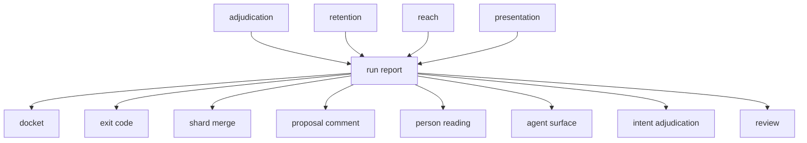

# Run report

«entity»

## Responsibility

Defines the versioned artifact a run leaves behind — every **subject**, its
**verdict**, its regions, its **cause**, what was absorbed, what was held still
and what was never observed — together with the derivations over it that belong
to the format rather than to any of its readers.

## Bounded context

[Report](../../DOMAIN.md#report)

## Inputs and outputs

In: observations, region records with their **fingerprint**s, the **ignore** and
**sensitivity** ledgers, the composition of the suite against itself and the
declared **variation**s, from [`adjudication`](../../adjudication/README.md);
**churn**, **recurrence** and **drift** rows from
[`retention`](../../retention/README.md); the **not observed** list and the
reach report from [`reach`](../../reach/README.md); the **presentation signal**
from [`presentation`](../../presentation/README.md).

Out: one JSON document with an integer version, and a reader that refuses
anything that is not one. Beside it, three derivations any reader may ask for
and none may re-implement: the **cluster**ing of a run's regions into the
distinct things that happened, whether promoting a given subject would land and
what it would refuse, and what accepting a selection would record about why a
**baseline** is what it is.

## Depends on

Nothing in this block. It is the thing the rest of the block reads.

## Used by

- [`docket`](../docket/README.md) — the observations, regions and coverage list it folds
- [`exit code`](../exit-code/README.md) — verdicts, diagnostics, instability and
  the coverage list, read structurally so that deciding an integer cannot
  acquire a reason to open a browser
- [`shard merge`](../shard-merge/README.md) — the singular fields that must
  agree, and the ledgers it recomputes
- [`proposal comment`](../proposal-comment/README.md) — the drift rows, the
  coverage list and the warnings
- [`person reading`](../person-reading/README.md) — everything, rendered
- [`agent surface`](../agent-surface/README.md) — the subject every report tool answers about
- [`intent adjudication`](../intent-adjudication/README.md) — the clusters a
  claim is matched against
- [`review`](../../review/README.md) — the **build** uploaded for decision, and
  the record a promotion writes

## Boundary

It reads no disk except through one entrypoint of its own, holds no clock — the
timestamp is supplied by the caller — and requires nothing to open, because a
reader with a JSON file and nothing else must not have to install a comparison
engine or a history client to name the type of a field. It carries no masks and
no encoded images: what is kept is what a sentence needs, and a consumer wanting
the full graph recomputes it from the snapshots. Every optional field means *the
writer never said* and never *there was none* ([absent is not
empty](../../DOMAIN.md#run-report)); a malformed coverage entry is refused
outright rather than partly understood. The promotion rules state what *would*
happen and promote nothing, so anything may ask without acting.

## Implementation coordinates

- `packages/report/src/format.ts` — `RunReport`, `ObservationRecord`, `RegionRecord`, `NotObserved`
- `packages/report/src/file.ts` — `writeRunReport`, `readRunReport` and its refusals
- `packages/report/src/{composition,reach,variation,declarations,history-records,presentation-record,finding-record}.ts`
  — the sections
- `packages/report/src/cluster.ts` — `clusterChanges`
- `packages/report/src/promotion.ts` — `promotionOf`, `selectByShape`, `whyNotWhole`
- `packages/report/src/changelog.ts` — `changelogOf`
- `packages/cli/src/commands/run-report.ts` — the superset a command line
  writes, and the sentence that marks another shard's subject

## Diagram

