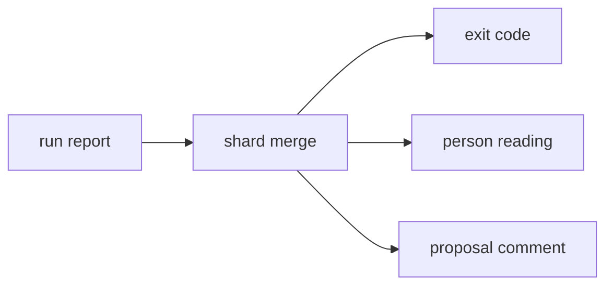

# Shard merge

«service»

## Responsibility

Folds the artifacts of N partial runs into one that can say nothing a single run
could not, or refuse by name.

## Bounded context

[Report](../../DOMAIN.md#report)

## Inputs and outputs

In: several artifacts, each with the path it was read from.

Out: one artifact, or a refusal naming both disagreeing shards and the field they disagreed on.

## Depends on

- [`run report`](../run-report/README.md) — the singular fields, the
  observations, the coverage list and the **ignore** ledger
- [`exit code`](../exit-code/README.md) — the gate a promoted coverage hole is answered by

## Used by

- [`person reading`](../person-reading/README.md) — the suite-level artifact all
  three readings ask about
- [`proposal comment`](../proposal-comment/README.md) — the one comment a
  sharded suite gets instead of N

## Boundary

Every field that is singular in one run — the **renderer identity**, the
retention, the run version, the author's stated intent — must agree across the
shards or the merge is refused. Picking one and carrying on would attribute half
the observations to a machine that never saw them, and a merge that guesses is
worse than no merge because what it produces looks exactly like a real artifact.
Absence is a value in that comparison, not a skip: a shard run with a declared
intent and one without were asked different questions.

A **subject** every shard excluded is promoted from a decision to a failure.
Narrowing a run to a slice records every subject outside it as excluded, so
merging naively makes each subject observed once and excluded twice; dropping
the exclusions instead would throw away the only evidence of the case that
matters, which is a split that covered the suite incompletely — excluded
everywhere, red nowhere. A correct split never produces one.

It merges nothing that is not a fold over per-subject answers. The composition
section is the run's subjects compared to each other, and the split is exactly
what destroys it, so it is dropped out loud in the warnings rather than omitted.
The ignore ledger is recomputed over the merged observations rather than summed,
because a rule is dead when it absorbed nothing anywhere and no shard is in a
position to say so.

## Implementation coordinates

- `packages/cli/src/commands/merge.ts` — `mergeReports`, `agree`, `coverageOf`,
  `ignoresOf`, `unmergeable`
- `packages/cli/src/commands/run-report.ts` — `shardFilterBecause`, `isShardFilter`

## Diagram

