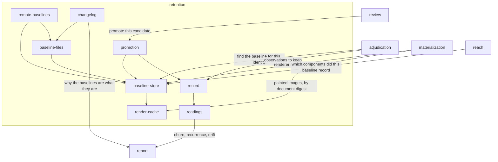

# Retention

## Responsibility

Keeps readings and decisions across time under an identity that says which of
them may be compared.

## Logical role

The system's memory. Every other block answers a question about one run;
this one is what makes a question about the past askable at all — it holds
the **baseline** a comparison is taken against, the **approval** that moved it,
and the record from which **churn**, **recurrence** and **drift** are computed.

## Boundary

It does not render, does not compare two readings, does not classify a
difference into a **band**, and never produces a **verdict**. It decides nothing
and gates nothing: a person's decision arrives from
[`review`](../review/README.md) already made, and this block writes it down.

## Technology

TypeScript on Node. A filesystem for baselines in a directory, `git` and
git-LFS for baselines that travel with a branch, `node:http` for both hops, and
SQLite through `node:sqlite` for the shipped record backend.

## Implementation coordinates

- `packages/raster/src/store.ts` — the store contract, the refusal, the
  in-memory store, the identity codec
- `packages/store/` — `durable.ts`, `lfs.ts`, `changelog.ts`
- `packages/remote/src/store.ts`, `packages/remote/src/serve-store.ts`,
  `packages/remote/src/transport.ts`
- `packages/history/` — rows, contract, arithmetic, client
- `packages/server/` — the record service and its pluggable backend
- `packages/cli/src/commands/history.ts`, `history-report.ts`, `accept.ts`,
  `images.ts`

## Communicates with

- → [`report`](../report/README.md) — churn, recurrence and drift, and the
  changelog explaining why the baselines are what they are
- ← [`adjudication`](../adjudication/README.md) — the lookup for a prior reading
  under an identity, and the observations to keep
- ← [`materialization`](../materialization/README.md) — the renderer identity
  that partitions the store, and the render cache keyed by document digest
- ← [`reach`](../reach/README.md) — a request for which components each baseline recorded
- ← [`review`](../review/README.md) — a promotion, written through the baseline
  store contract; the authorization for it is recorded where the decision was
  made

## Uses

### [Report](../report/README.md)

#### Why

The explanation of a baseline update is written where the baseline is: in the
commit that carried it. That makes the writer of the explanation the block that
owns the **run report** format, and the reader of it this one. Accepting the
coupling keeps one grammar for the record; refusing it would mean a second
parser here that drifts from the writer and silently reads a well-formed
explanation as none.

#### What I need from it

The record format carried in a commit trailer and the parse that recovers it,
and the record shapes a run's answers are carried in so that churn, recurrence
and drift travel in the artifact rather than down a socket held open.

#### What would make me leave

The explanation ceasing to live in the commit — a store whose baselines are not
commits at all has nowhere to put it, and the record would move here as a row
beside the approval.

## Components

| Component | Responsibility |
|---|---|
| [baseline-store](./baseline-store/README.md) | The contract every backend answers on, and what a stored reading has to carry before it is believed |
| [baseline-files](./baseline-files/README.md) | Baselines on a filesystem, partitioned by identity, in a directory the runner owns or on a branch that carries them |
| [render-cache](./render-cache/README.md) | Images already painted, addressed by the digest of the document that painted them |
| [remote-baselines](./remote-baselines/README.md) | The same store on the other side of a hop, and the half that serves it |
| [record](./record/README.md) | The append-only record of what runs observed, and the service that keeps it |
| [readings](./readings/README.md) | Churn, recurrence and drift over that record, and the sentence each one is said in |
| [promotion](./promotion/README.md) | Writing a reviewed candidate in as the baseline and appending the decision that authorized it |
| [changelog](./changelog/README.md) | Why the baselines are what they are, read back out of the commits that carried them |
| `packages/remote/src/transport.ts` | L5 — a fetch with a deadline, shared by both halves of the hop |
| `packages/history/src/instant.ts` | L5 — the timestamp parse the arithmetic shares |
| `packages/server/src/http-parse.ts`, `http-errors.ts`, `http-request.ts` | L5 — request checking and status codes for the record service |

## Diagram

