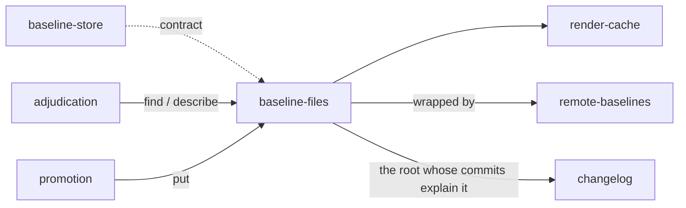

# Baseline files

«adapter»

## Responsibility

Keeps **baseline**s on a filesystem, in a layout whose directories are the
identity partition, whether the root is a directory the runner owns or a tracked
path that travels with a branch.

## Bounded context

[Identity and retention](../../DOMAIN.md#identity-and-retention)

## Inputs and outputs

In: a root, a placement, and the lookups and writes of
[`baseline-store`](../baseline-store/README.md). Out: an image and the sidecar
beside it, read as a **raster** once it has passed the record checks.

The image and its sidecar are a pair, and the pair is the unit. Bytes are not a
baseline: what makes them one is the **renderer identity** that painted them,
the dimensions, the fonts that were missing, the **digest** of the document they
came from, and the **component hash**es that document rendered. The sidecar
stays text, so the half of the artifact a person can review stays reviewable.

Placement is the operator's. One placement keeps every image for a root under a
single identity directory and encodes a subject's slashes into one filename,
which is the shape to take when the baselines are a corpus somebody backs up or
points a bucket at. The other spends the slashes, so a baseline lands in the
directory holding the component it is a baseline of and is in the same review,
the same move and the same delete as the code.

Where the root is a tracked path, images go through a large-file filter and the
sidecars do not. The bytes stay ordinary files — a checked-out tree
already holds the real image at the real path, and routing reads through the
version-control tool would add a second way to obtain the same bytes and
therefore a way for the two to disagree. What the tool is consulted for is
whether the glob is genuinely routed through the filter, and its absence
degrades to a diagnostic rather than a failed run.

## Depends on

- [`baseline-store`](../baseline-store/README.md) — the contract, the refusal,
  and the checks a stored record passes before it is believed
- [`render-cache`](../render-cache/README.md) — supplied by every backend, and
  given a root of its own where the baseline root is one somebody commits

## Used by

- [`remote-baselines`](../remote-baselines/README.md) — what the serving half
  wraps, so remote means durable, further away
- [`promotion`](../promotion/README.md) — the pairing a promoted candidate is written in
- [`changelog`](../changelog/README.md) — the root whose commits are read for the explanation
- [`adjudication`](../../adjudication/README.md) — the default place a
  comparison's other side comes from

## Boundary

The layout is the rule rather than a convention. A baseline written under one
identity is not in the directory another identity reads, so the wrong baseline
is not where the lookup looks, rather than a check somebody has to remember to
call. The lookup then
scans the sibling identities so it can say what it *did* find, which is what
turns a wrong-machine run from an unattributable mass failure into one sentence.

The partition exists once. The branch-carried backend reimplements no path
decision and delegates every one of them, because a second copy of the layout is
a second chance to get the partition wrong, and the partition is the only thing
standing between a runner upgrade and a day of red nobody can attribute.

The cheap answer reads the sidecar and stats the image, written out rather than
expressed in terms of the full lookup — *in terms of the full lookup* is exactly
the megabyte it exists not to spend. It hands on component *names* and never
hashes: a name can only answer membership, and membership is the only question
selection is allowed to ask.

A pointer file where an image should be is refused by name. It is what a clone
without the filter installed holds, it is not a baseline, and comparing a
subject against it would be comparing a subject against a text file.

## Implementation coordinates

`packages/store/src/durable.ts` — `createDurableStore`, `BaselineLayout`, and
the identity-partitioned path; `packages/store/src/lfs.ts` — `createLfsStore`,
the tracking check, the pointer refusal, and the injectable command runner that
separates *this is not a repository* from *this machine has no such tool*.

## Diagram

