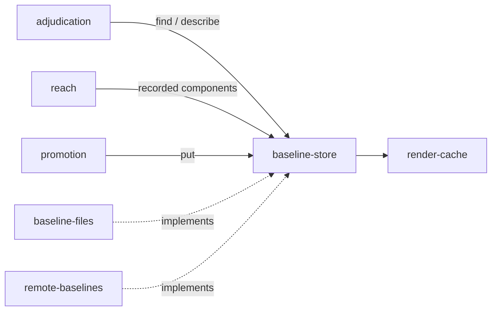

# Baseline store

«repository»

## Responsibility

Defines what a **baseline** lookup asks, what it may answer, and how a stored
record is checked before anything is believed about it.

## Bounded context

[Identity and retention](../../DOMAIN.md#identity-and-retention)

## Inputs and outputs

In: a subject key, optionally labelled to distinguish several images of one
**subject**, and the **renderer identity** now asking. Out: the stored
**raster** with a statement of whether the identity now asking is the identity
that wrote it; or the same answer without the bytes, which is the cheap path —
the **digest** of the document the stored image was painted from, the fonts the
renderer did not have, the accessibility evidence retained beside it, the
**component hash**es' component names, and what inspection marked. A caller may
declare up front which keys it is about to ask about; the declaration is a hint
and never a question, and a lookup outside it is answered exactly as it would
have been.

Two retentions answer this one contract. A durable one keeps the image for a
later week and is only sound because identity is stated and comparison across it
is refused. An ephemeral one produces both images now, discards them, and has
nothing to say about comparability because there is only one machine in the
story — so it answers nothing to every lookup and accepts every write silently,
which is what lets one pipeline serve both.

## Depends on

- [`render-cache`](../render-cache/README.md) — reachable from every store as a
  property, because it is a different object with a different contract

## Used by

- [`baseline-files`](../baseline-files/README.md) — the shape it implements, the
  refusal it raises, the record checks it passes bytes through
- [`remote-baselines`](../remote-baselines/README.md) — the same, on both sides of the hop
- [`promotion`](../promotion/README.md) — the write a reviewed candidate lands through
- [`adjudication`](../../adjudication/README.md) — the lookup a comparison begins with
- [`reach`](../../reach/README.md) — the component names a baseline recorded,
  which is how a subject an edit could not have moved is never collected

## Boundary

Where a baseline is kept decides nothing, and no answer here names a backend: a
disk saying EACCES and a socket saying 500 arrive as one error type, because a
message cannot be matched on and a caller with a list of failures to recognise
has already lost the distinction.

A store that cannot answer produces an operator error and never a **verdict**: a
failed lookup reported as an absent baseline makes the subject new, and a new
subject records whatever is on screen over the only copy of what it looked like
before. Absence is reserved for a store that looked and positively said there is
nothing ([absent is not empty](../../DOMAIN.md#identity-and-retention)).

The lookup is not scoped to the current identity. Answering nothing
for a baseline that exists under another identity would say *we have never seen
this*, which is a different and much less useful sentence than *we have seen
this, on a machine you are not*.

The cheap answer is not a cheaper lookup: it can say whether anything could have
moved, never what moved, so a caller that then has to compare pays for a second,
full lookup.

## Implementation coordinates

`packages/raster/src/store.ts` — `RasterStore`, `BaselineKey`, `Found`,
`Described`, `Retention`; `RasterStoreError` and `REFUSAL`;
`createEphemeralStore`; `identityFrom`, the field-by-field rebuild of an
identity off a wire, on the path of every sidecar, every remote response and
every cache read-back.

## Diagram

