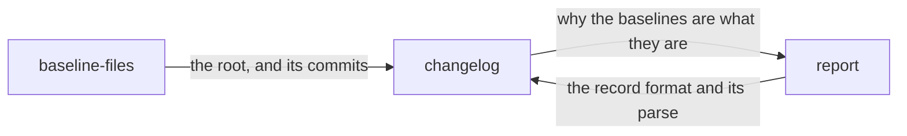

# Changelog

«repository»

## Responsibility

Reads back the explanation of why the **baseline**s are what they are, out of
the commits that carried them.

## Bounded context

[Identity and retention](../../DOMAIN.md#identity-and-retention)

## Inputs and outputs

In: the baseline root, and how far back to look. Out: the commits under that
root that carried a baseline update, newest first, each with the record it
carried and the date it landed — or a sentence saying nobody could ask.

Where baselines are commits, the commit message is where the explanation of an
update was put, and this is the other direction of that. The point of putting it
there is that it outlives the job that produced it, findable by somebody later
asking why a baseline looks like this.

Only commits touching a path under the root are read. The filter is what keeps
it cheap and what keeps it honest — a repository's ordinary commits are not
baseline updates, and scanning them all would spend the whole log to reach the
same answer.

## Depends on

- [`baseline-files`](../baseline-files/README.md) — the root whose commits are
  read, and the one tool this side of the block already shells out to
- [`report`](../../report/README.md) — the record format written into the commit
  trailer, and the parse that recovers it

## Used by

- [`report`](../../report/README.md) — the explanation behind the baselines a run compared against

## Boundary

It reads and never writes. The write half is a commit message composed
elsewhere, and a second composer here would be a second grammar for the same
record.

An empty answer is a real answer only when the tool ran, this is a repository,
and no commit under the root carried a record; every other case is a sentence
naming what could not be asked
([absent is not empty](../../DOMAIN.md#identity-and-retention)).

A bounded reading says it was bounded, and by what. A shallow checkout sees one
commit and would otherwise report it as the whole history of a baseline; a
trailer no reader here understands and a limit the log filled are two more
reasons an answer is a lower bound, and they compose, so what bounded a reading
is a list rather than a flag.

It has no opinion about which backend wrote the bytes. Whether an explanation
exists is a property of the checkout rather than of the store object — a plain
directory inside a repository answers here exactly as a tracked one does.

## Implementation coordinates

`packages/store/src/changelog.ts` — `readChangelog`, `wasRead`,
`ChangelogHistory` and `Unreadable`.

## Diagram

