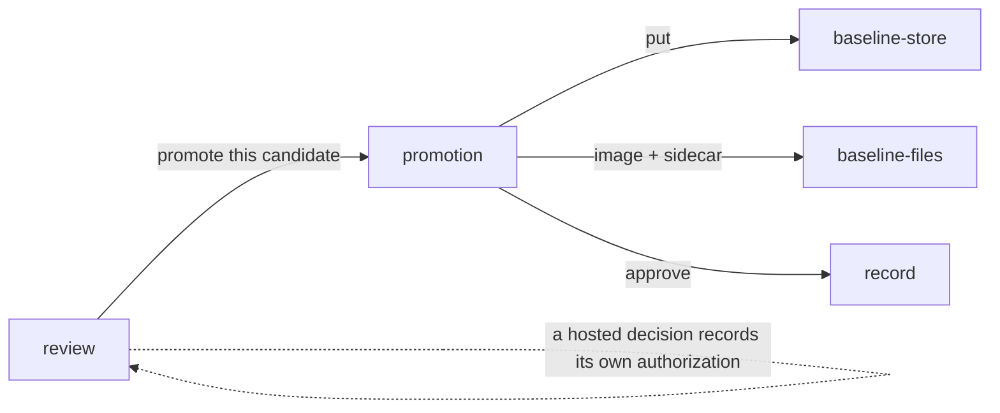

# Promotion

«handler»

## Responsibility

Writes a reviewed **candidate** in as the **baseline** and appends the decision
that authorized it.

## Bounded context

[Identity and retention](../../DOMAIN.md#identity-and-retention)

## Inputs and outputs

In: a run's artifact, the images it points at, and the **subject**s named on the
command line. Out: a baseline written under the identity that painted it, and
one **approval** row per subject and run saying somebody approved what that run
proposed.

A decision taken in a hosted review surface reaches the baseline through the
same [`baseline store`](../baseline-store/README.md) contract, but records its
own authorization where it was made. The **approval** row is written on this
path only, which is why the two paths answer *who approved this* from two
places.

The run leaves the candidate and its sidecar behind precisely so this is
possible: the image is what makes a subject promotable at all, and the sidecar
carries the identity, the dimensions, the missing fonts, the document
**digest** and the **component hash**es, in the same pairing the store itself
uses.

## Depends on

- [`baseline-store`](../baseline-store/README.md) — the write, and the identity
  the write lands under
- [`baseline-files`](../baseline-files/README.md) — the image-and-sidecar pairing on disk
- [`record`](../record/README.md) — the append that says somebody agreed

## Used by

- [`review`](../../review/README.md) — where a named person decides; a hosted
  decision moves the baseline through the store contract and keeps its own
  record of having done so

## Boundary

Promotion moves evidence that already exists. A version of this that re-rendered
would render *here*, later,
possibly on another machine, and write that image as the baseline — the subject
would be re-based against a render nobody reviewed, by the one command whose
whole job is to write into the identity partition. So there is no browser, no
renderer and no document: the inputs are an artifact and the files it points at,
and a run that left no image is refused by name.

A candidate whose sidecar cannot be read is refused rather than reconstructed.
An invented document digest would settle every future run against an image
nobody can reproduce, and a refusal is cheap where a baseline recorded from an
unreproducible render is permanent and invisible.

It records the decision and nothing else. It does not write observations,
because an artifact carries regions and pixels and the per-component hashes are
neither in it nor derivable from it — a row with fabricated hashes would corrupt
every later drift question. The split is what makes both halves possible: the
run writes the hashes and cannot know whether anybody agreed, and this knows
somebody agreed and cannot know the hashes. They are joined on the subject and
the run, which is exactly the decision a reviewer makes.

The decision is keyed no finer and no coarser than that. Keyed per hash it would
invent a decision nobody made; keyed per run, one approved subject would approve
every other subject in the run. An artifact with no run id cannot be joined to
anything, so nothing is recorded and the result says so — an invented id would
attach somebody's approval to a build that never happened.

Deciding is not writing. Nothing here checks who is permitted to promote; the
**capability** that separates the party that may upload evidence from the party
that may promote it belongs to [`review`](../../review/README.md), and a
decision arrives here already made. Recording it is best effort — a store that
is down becomes a warning naming what was not written, never a **verdict** and
never silence.

## Implementation coordinates

`packages/cli/src/commands/accept.ts` — the promotion, the sidecar refusal, and
the approval row; `packages/cli/src/commands/images.ts` — the candidate, its
sidecar and the diff a run leaves behind, and the only place in the run that
touches image bytes at all.

## Diagram

