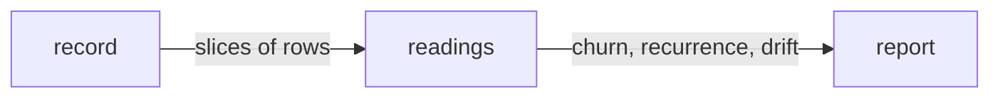

# Readings

«policy»

## Responsibility

Turns recorded rows into the four answers a single run cannot give — how often a
component changed, how often a **subject** read differently from itself, what a
value drifted to, and where a component started appearing — and says each one in
a sentence that cannot be mistaken for a finding it is not.

## Bounded context

[Identity and retention](../../DOMAIN.md#identity-and-retention)

## Inputs and outputs

In: slices of rows somebody else fetched, and the window they were fetched over.
Out: **churn** per band, **recurrence** with its denominator, a token's
**drift** as a journey with the commits behind it, and the reach of a component
across subjects — each carrying what the window excluded.

The finding the whole record exists for is arithmetic over values rather than
over runs: many small approved steps whose total no single review ever saw. A
single large step is not that finding — it was reviewable as one change and
whoever approved it saw its full size. A value that cannot be subtracted is a
reportable finding rather than an error.

## Depends on

- [`record`](../record/README.md) — the row vocabulary, and the slices every number is computed over

## Used by

- [`record`](../record/README.md) — the service computes its answers here rather
  than in a query per engine
- [`report`](../../report/README.md) — churn, recurrence and drift, carried in
  the artifact rather than fetched when somebody looks

## Boundary

A rate divides by the occasions that could have produced an observation. A
window with no such occasion has no rate
([absent is not empty](../../DOMAIN.md#identity-and-retention)). A normal run
asks whether a subject agrees with itself only after the comparison already
called it changed, so the denominator for recurrence is the **sweep** and not the
run; a subject that never came out changed was never asked, and dividing by runs
reports a **flake** that fires every time it is examined as a rare one.

Recency counts examinations, not days. *Unstable in six of twenty* says a
fixture is bad and *six times, none in the last nine sweeps* says somebody
already fixed it, and those are opposite instructions — counted in days, a suite
that stopped running would look increasingly fixed the longer nobody looked.

Only approved changes count. A rejected change was caught; counting it describes
the review process instead of the product, and does so in the direction that
looks alarming. The flag a run wrote is provenance about the write and never the
answer, because acceptance happens afterwards by somebody who looked — a reader
that filtered on it would report a component that changed on every run as never
having changed, and be believed.

Collateral never accumulates. A component whose geometry moved while its own
structure and style held was displaced by an edit somewhere else, and summing
displacement makes the widest container in the application the thing that keeps
changing, in every run, forever. It is counted and reported separately, which is
what keeps it from looking like zero.

Bands are compared only where they are comparable. One of them is portable
across tiers and counted across all of them; the others are not, and a rate that
crossed tiers on either would measure which tier ran rather than what anyone
edited.

An absorbed occurrence is counted and kept apart. A subject that declared which
bands it asserts on is not lying when its clock ticks — that occurrence never
gates and is never a finding — but a rule absorbing something in every run for
six months is worth being able to ask about, because a declaration nobody
re-reads is how a suite quietly stops watching something.

The sentences add nothing to the numbers. A wrong number is a defect in the
arithmetic; a correct number in a sentence that reads as a finding when it is
not is a defect here and is invisible to any test of the arithmetic — so no
fraction is reduced to a bare percentage, whatever the window excluded is stated,
and *no runs are recorded in this window* is never said as *stable*.

## Implementation coordinates

`packages/history/src/churn.ts` — `accumulateChurn` and the four rules;
`packages/history/src/flakiness.ts` — `accumulateFlakiness`, the sweep
denominator and the recency count; `packages/history/src/token-drift.ts` —
`detectDrift`, the quantity parse and its refusals;
`packages/history/src/sentences.ts` — one line per answer;
`packages/history/src/drift.ts` — the single import path over the three;
`packages/server/src/answers.ts` — the slices, assembled;
`packages/cli/src/commands/history-report.ts` — the three states a run can be in
about its own record.

## Diagram

