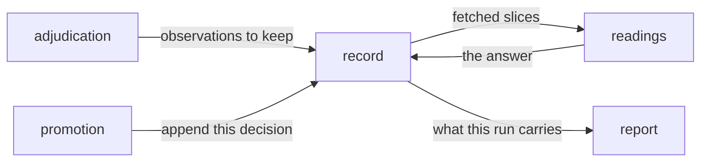

# Record

«repository»

## Responsibility

Keeps, append-only, what every run observed — which hashes moved, which values
were resolved, which **subject**s disagreed with themselves, and that the run
happened at all.

## Bounded context

[Identity and retention](../../DOMAIN.md#identity-and-retention)

## Inputs and outputs

In: one write per run — the run itself, one row per subject, component and
hashed band whose **digest** moved, the token values the run resolved, and the
**instability** occurrences it saw. Out: small slices, each one a query a single
index can serve, plus the one read about the present that a run needs before it
can write.

A row is roughly a hundred bytes and is written only on movement, so a run in
which two components changed writes two rows. A row is
never a pixel, a coordinate, a rectangle or a count of pixels: a pixel count is
dominated by how much page sits below the edit, so it measures displacement
rather than magnitude, and it is machine-bound on top of that. A content hash
has neither problem — it moves when the component's own code moves and means the
same thing on every machine.

The service is the operator's: a process, a port and a token they set. It stores
what the operator's own runs produced, reaches out to nothing, and refuses a
write it cannot attribute to its configured token.

## Depends on

- [`readings`](../readings/README.md) — the arithmetic that turns fetched slices
  into an answer, so that no backend re-derives a rule and the second engine
  gets one of them wrong silently

## Used by

- [`promotion`](../promotion/README.md) — the call that appends a decision
  against a subject and a run
- [`readings`](../readings/README.md) — the row vocabulary every number is computed over
- [`adjudication`](../../adjudication/README.md) — the observations a run leaves behind
- [`report`](../../report/README.md) — what a run carries about its own past

## Boundary

It stores and it does not decide. No backend may judge anything uninteresting,
and every slice reports what a limit excluded, because a capped answer that does
not say it was capped reads as a complete one and a total computed over a
truncated slice is a lower bound its reader will treat as the amount the product
moved.

The read that feeds the write-only-on-movement rule never truncates and takes no
limit. Everywhere else a partial answer is a lower bound a reader can be told
about; here it is different in kind, because a missing previous row is
indistinguishable from a hash that never existed, so the run writes a change that
did not happen and that row is permanent. A request too large to answer whole is
refused loudly instead, and the caller splits its subject list rather than
accepting less. When the same key has several rows in scope, the newest wins.

A quiet run is still recorded. It is the denominator, and the run is a required
argument rather than something inferred from the rows precisely because the run
in which nothing changed has no rows and is exactly the run that must not be
lost.

Nothing is repaired on the way in. An unparseable timestamp, an unknown band or
a **profile** nothing has heard of is refused at the door rather than stored and
discovered later, because a bad row already in an append-only store cannot be
taken out again. Authentication happens before routing, so a request without a
valid token is refused whatever it asked for — the alternative hands an
unauthorised caller a map of the questions and answers *that subject exists* to
somebody holding nothing.

An append-only store cannot flip a flag. Whether a change was accepted is a
second row and never an edit, because two branches observing different hashes
for one key are two rows and the moment anything may overwrite one the store
acquires the merge problem it exists to escape.

Nothing loads a whole history. There is no query that grows with the age of the
project, because the first thing anyone would do with one is compute on the
caller a number the service could have computed.

The absence of a record is its own answer
([absent is not empty](../../DOMAIN.md#identity-and-retention)). A store may be
unconfigured, and the thing held in its place accepts writes and discards them
so a run that would otherwise succeed does not fail — but every question it is
asked comes back as a sentence naming the missing store, phrased around the
question that was asked.

## Implementation coordinates

`packages/history/src/observation.ts` — `Observation`, `RunRecord`,
`TokenValue`, and the hashed bands; `packages/history/src/instability.ts` — the
occurrence row and the frequency band it is named in;
`packages/history/src/approval.ts` — the decision row and the key it meets an
observation on; `packages/history/src/store.ts` — `HistoryStore`, `Window`,
`Unkept`, `Answer`; `packages/history/src/absent.ts` — `createAbsentStore` and
`unkept`; `packages/history/src/client.ts` and `answers.ts` — the hop and the
checking of everything that comes back; `packages/history/src/protocol.ts` — the
paths both halves share; `packages/server/src/backend.ts` — the storage seam;
`packages/server/src/backend-sqlite.ts` and `sqlite-*.ts` — the shipped engine,
named at runtime in exactly one file; `packages/server/src/http.ts` and `bin.ts`
— the socket and the process; `packages/cli/src/commands/history.ts` — the
caller that assembles a run's rows and reads its own past.

## Diagram

