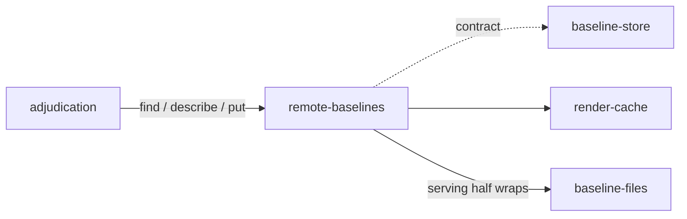

# Remote baselines

«gateway»

## Responsibility

Answers the same **baseline** contract across a hop, and serves it from the
other side.

## Bounded context

[Identity and retention](../../DOMAIN.md#identity-and-retention)

## Inputs and outputs

In: an endpoint, a bearer token the operator set, and a deadline. Out: the same
answers a local lookup gives, checked on arrival by the same record checks a
lookup off a disk passes.

One route per question, and the cheap answer earns its own route rather than a
flag on the full one — the saving is the response body, and a route whose cost
is decided by a flag is a cost somebody can forget. What a run declares up front
becomes one request for the whole working set instead of one round trip per
subject to answer thirty-two hex characters each; the full lookup still goes to
the endpoint for every subject whose document moved, because that is the subject
whose bytes are actually needed.

The client and the serving half are one protocol and live together. Released
apart they drift, and a client and a server disagreeing about a wire format is
the failure that presents as a **verdict**.

## Depends on

- [`baseline-store`](../baseline-store/README.md) — the contract on both sides,
  the refusal, and the record checks applied to what comes off the socket
- [`baseline-files`](../baseline-files/README.md) — what the serving half wraps,
  so that *remote* means *durable, further away*
- [`render-cache`](../render-cache/README.md) — two routes of its own, held to
  their own rule rather than to this one

## Used by

- [`adjudication`](../../adjudication/README.md) — the alternative for a team
  that will not keep images in the repository

## Boundary

A store failure is never a **verdict**. An unreachable endpoint, a 500, a 401, a
timeout, a body that cannot be read as an answer — every one raises the operator
error and none of them ever produces an absent baseline
([absent is not empty](../../DOMAIN.md#identity-and-retention)).

It owns no storage and no partition. What crosses the wire is the same
**renderer identity** a local lookup would use, so a server backed by a
filesystem answers *not comparable* for another machine's baseline for the
reasons that backend gives, and this side neither adds that behaviour nor is
able to remove it. Owning storage here would be a second implementation to
disagree with the first about where a baseline lives and which identity wrote
it.

Construction does not hand-shake. A renderer has an identity that must be
learned before anything can be trusted; a store has none of its own, because the
identity in play belongs to the renderer and is carried on every call.

The working set is read once, at the start, so a store another job writes to
mid-run is answered from before that write — already true of a run that read a
subject before the write landed, and the reason an **approval** is a recorded
decision rather than a race.

## Implementation coordinates

`packages/remote/src/store.ts` — `createRemoteStore`, the route constants, and
every parse that makes an unrecognised body an error rather than a shrug;
`packages/remote/src/serve-store.ts` — `serveRasterStore`, the transport-only
serving half; `packages/remote/src/transport.ts` — the fetch that has a
deadline, because a store that hangs must fail rather than stall the run, and
the same fetch [`materialization`](../../materialization/README.md) takes its
renderer hop over, which is why the coordinate is shared rather than owned.

## Diagram

