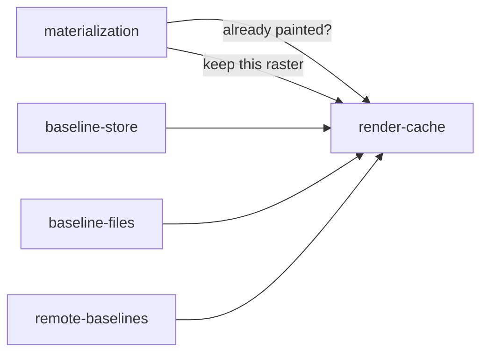

# Render cache

«repository»

## Responsibility

Keeps images this machine has already painted, addressed by the **digest** of
the document that painted them under the identity that painted it.

## Bounded context

[Identity and retention](../../DOMAIN.md#identity-and-retention)

## Inputs and outputs

In: a **raster** to keep, or a document digest and a **renderer identity** to
look one up by. Out: the image, or nothing.

## Depends on

Nothing. Every backend builds one out of whatever it already has — a disk, a
socket, a map in memory — and is wrapped at construction so the rule below is a
property of the value rather than a promise in a comment.

## Used by

- [`baseline-store`](../baseline-store/README.md) — reachable from every store as a property
- [`baseline-files`](../baseline-files/README.md) — a directory, kept out of a tracked root
- [`remote-baselines`](../remote-baselines/README.md) — two routes on the same hop
- [`materialization`](../../materialization/README.md) — the deferral lever: a
  document whose digest is already here is not painted again

## Boundary

It never throws. A miss, an outage, a permission error, a corrupt entry and a
response nobody can parse are one answer, because the response to every one of
them is identical: paint it. A write resolves whether or not anything was
written.

That is why it is not part of the **baseline** contract. The two have opposite
loss semantics: losing a baseline destroys the thing this run was
meant to compare against and must stop the run, while losing a cache entry costs
one render. Welded together, the cache inherits the baseline's paranoia and a
backend fails a build over an optimisation.

A cache that is failing is indistinguishable from a cache that is cold, so a
broken one makes a run slow and never makes it red, and an operator watching a
pipeline get slower has to go looking.

Correctness never rests on it. A hit is an image of exactly this document on
exactly this machine — a wrong location, a stale entry or a cache shared between
projects can cost a render and cannot produce a wrong image.

Where the baseline root is one an operator commits, the cache does not live in
it. The cache gains an entry for every edit and is worth nothing after the next
one, and a tracked root that grows without bound with images nobody will look at
spends the quota bought for baselines.

## Implementation coordinates

`packages/raster/src/store.ts` — `RenderCache` and `neverFails`, the wrapper
that holds every backend to the rule; the in-memory cache in
`createEphemeralStore`. That file also holds the **baseline** contract
[`baseline-store`](../baseline-store/README.md) owns, and
[`materialization`](../../materialization/README.md) coordinates it as the
caller of the cache: one module, two contracts, and the coordinate is shared on
both counts. Backends: `packages/store/src/durable.ts` (`cacheRoot`),
`packages/remote/src/store.ts` (`CACHE_FIND_PATH`, `CACHE_PUT_PATH`).

## Diagram

