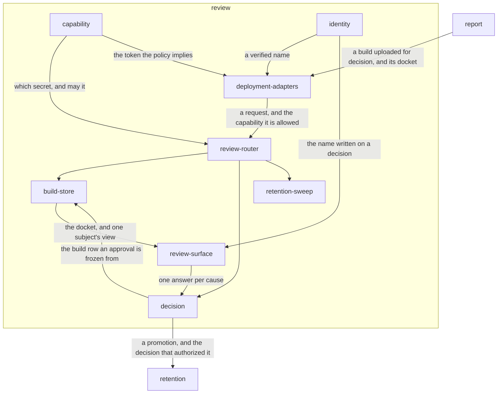

# Review

## Responsibility

Turns one named person's answer per **cause** into the **baseline** it moves and
the append-only row that says who moved it.

## Logical role

Everything upstream produces claims about software; this is where a claim becomes
a commitment somebody's name is on. The whole block is organized around one
distinction: writing evidence and deciding it are two capabilities, and they may
never be one value.

## Boundary

Nothing here observes: no **verdict**, no **cause** and no region is computed in
this block — each arrives already attributed from
[adjudication](../adjudication/README.md) inside the artifact
[report](../report/README.md) owns — and a promotion moves evidence a run already
uploaded rather than painting any.

It owns neither the **baseline** store nor the record it re-serves from the same
socket; those are [retention](../retention/README.md)'s protocols, restated here
over this deployment's own bindings so one address answers a run and a reviewer.

## Technology

TypeScript. The whole service is one `fetch` handler and names no runtime: every
module above the bindings takes a SQL database and a key-addressed object store
declared as two narrow structural interfaces, so the routes, the refusals and the
status codes are the same code wherever it runs. React for the surface, with no
router, no data library and no CSS toolchain. Two deployments ship — Cloudflare
Workers over D1, R2 and Access, and a process on a machine somebody owns over
`node:sqlite`, `node:fs` and `node:http`.

## Implementation coordinates

- `packages/tribunal/src/` — the router, the capability rule, the build store, the
  decision, the sweep
- `packages/tribunal/src/ui/` — the review surface and its JSON client
- `packages/tribunal/src/node/` — the file-and-socket deployment
- `packages/tribunal/migrations/` — the stored shape, generated from the schema
- `tribunal-cloudflare/app/` — the deployed console: identity, the mount, the page

## Communicates with

- → [`retention`](../retention/README.md) — a promotion, written through the
  baseline store contract; the authorization for it is recorded where the
  decision was made
- ← [`report`](../report/README.md) — a build uploaded for decision, and the
  docket that is its agenda

## Uses

### [Retention](../retention/README.md)

#### Why

Approving cannot be a flag on a row. A **baseline** is not pixels: it is pixels
plus the digest of the document they were painted from and the **renderer
identity** that painted them, and the next run finds it by that identity or does
not find it. So the only honest way to record an approval is to write the
promoted **candidate** through the same store the next run reads — which means
this block accepts a dependency on retention's store contract rather than
inventing a second place a baseline can live. The tradeoff is that a decision
made here fails if that write fails; the ordering that makes that the safe
failure belongs to [`decision`](./decision/README.md).

#### What I need from it

A raster store addressed by **subject** and **renderer identity**, whose `put`
takes bytes and a sidecar and refuses rather than reconstructing a missing one.
An append-only record that accepts approvals and answers **churn**,
**recurrence** and **drift** for one subject at a time, so a reviewer can ask
whether the difference in front of them is the third this week or the first this
year.

#### What would make me leave

A retained store that could take a reference to a candidate already in this
deployment's object store, rather than a copy of its bytes — promotion would then
be a pointer written under an identity, and the coupling would narrow to naming.
Equally, a decision that had to be recorded somewhere this deployment cannot
reach would end the coupling in the other direction, by making the promotion
somebody else's write.

## Components

| Component | Responsibility |
|---|---|
| [review-router](./review-router/README.md) | Answers every request this deployment serves, and turns each refusal into a typed status rather than an empty answer |
| [capability](./capability/README.md) | Decides which of two secrets a caller presented, and whether that capability may do what the route requires |
| [identity](./identity/README.md) | Establishes that a request comes from a named person, so a decision can carry a name |
| [build-store](./build-store/README.md) | Keeps one run's uploaded evidence and reads it back as the **docket** a reviewer works from |
| [decision](./decision/README.md) | Records one person's answer for one **subject** and, when it is yes, promotes the **candidate** the run already uploaded |
| [review-surface](./review-surface/README.md) | Draws a build as causes first, regions second and images last, and collects the answer |
| [retention-sweep](./retention-sweep/README.md) | Removes builds past a window on request, and reports what it removed |
| [deployment-adapters](./deployment-adapters/README.md) | Wires the one handler to a runtime without changing a route, a refusal or a status code |
| `packages/tribunal/src/worker-http.ts`, `packages/tribunal/src/worker-input.ts` | L5 — the typed refusals and the readers every route validates its arguments through |
| `packages/tribunal/src/review-rows.ts` | L5 — column readers that refuse a malformed stored row rather than casting it |
| `packages/tribunal/src/ui/styles.ts`, `packages/tribunal/src/ui/text.ts` | L5 — the stylesheet as text, and number and word formatting |
| `packages/tribunal/src/testing.ts` | L5 — a database double over real SQLite and an in-memory object store |

## Diagram

