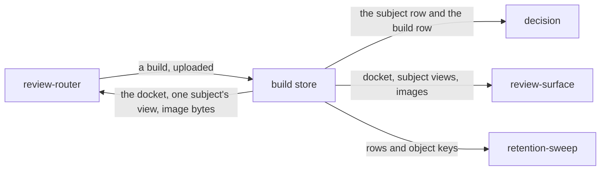

# Build store

«repository»

## Responsibility

Keeps one run's uploaded evidence — its subjects and their **verdicts**, its
regions, what it did not observe, what it declared, and the images it kept — and
reads it back as the **docket** a reviewer works from.

## Bounded context

[Review](../../DOMAIN.md#review)

## Inputs and outputs

In: a **build** — the versioned artifact a run already wrote, plus the images
already saved beside it. Nothing here invents a format, and a report at a version
this deployment does not understand is refused rather than stored as a shape
whose fields it would then misread.

Out: a build list, one build's summary and **docket**, one **subject**'s view
with the current decision against it, and the bytes behind an image address.

## Depends on

Nothing in this block.

## Used by

- [`review-router`](../review-router/README.md) — everything the read paths answer with
- [`decision`](../decision/README.md) — the subject row a promotion is built
  from, and the build row an explanation is frozen from
- [`review-surface`](../review-surface/README.md) — the shapes it draws a build from
- [`retention-sweep`](../retention-sweep/README.md) — the rows and object keys a window removes

## Boundary

It does not normalize. A run says *absent* in a dozen places where it could have
said empty, and each of those pairs is a distinction somebody downstream reads: a
coverage list that was never stated is not an empty one, findings nobody
collected are not an absence of defects, and a variation nothing compared is not
one compared and found identical. Each is stored in a column that permits the
distinction, and no reader collapses it — no rows read back as absent rather than
as an empty list, because an empty list would say the suite was read and found to
contain nothing at all.

It does not re-derive anything the run attributed. The **docket** is aggregated
here — one entry per **cause** component with its collateral counted, so one token
change across three hundred subjects is one item with a count — but the reasoning
that named a cause is [adjudication](../../adjudication/README.md)'s, arriving
inside the artifact [report](../../report/README.md) owns. The ranking is by cause
pixels rather than by [area](../../DOMAIN.md#cause).

It does not answer from a row alone when a row and an object are one artifact: an
object a row points at and that is not there is damage, and is reported as
damage rather than as a run that kept nothing.

## Implementation coordinates

- `packages/tribunal/src/review.ts` — `createReviewStore`, and the `ingest`,
  `builds`, `build` and `image` operations
- `packages/tribunal/src/review-ingest.ts` — objects before rows, the build's rows
  cleared before they are rewritten so a re-push cannot leave an old attribution
  beside a new one, and every statement in one batch. Decisions are never cleared:
  a person put their name on those
- `packages/tribunal/src/review-read.ts` — `summarize`, `latestDecisions` (the
  current decision is the highest sequence, never the newest timestamp),
  `docket`, `toSubjectView`, and the
  readers for reach, composition, movements and declarations
- `packages/tribunal/src/review-types.ts` — the shapes, kept free of a database
  binding so the router and the surface can both name them
- `packages/tribunal/src/schema.ts`, `migrations.ts`, `migration-steps.ts`,
  `packages/tribunal/migrations/` — the stored shape, additive only, each step
  writing the version it lands on

## Diagram

