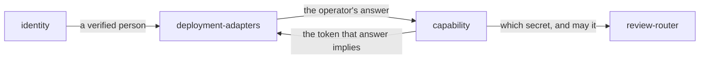

# Capability

«policy»

## Responsibility

Decides which of a deployment's two secrets a caller presented, and whether that
**capability** may do what the chosen route requires.

## Bounded context

[Review](../../DOMAIN.md#review)

## Inputs and outputs

In: the credential on a request, and the two secrets the deployment was
constructed with. Out: one of two capabilities or nothing at all, and — at the
mount — the authorization header the answer implies.

At construction it takes the two secrets and refuses the deployment outright:
under sixteen characters, or the two being one value.

## Depends on

Nothing. It is structural about its inputs, seeing two secrets and
not the deployment's project or its retention window, so that authentication
cannot be made to depend on either by a later edit.

## Used by

- [`review-router`](../review-router/README.md) — the check before parsing, and
  the check after routing
- [`deployment-adapters`](../deployment-adapters/README.md) — the
  operator-supplied policy, and the token substitution that makes it binding

## Boundary

It carries no names. A credential says what a holder may do and never who they
are; a machine ingests and does not decide, and anything that can hold the
deciding secret has no name to put on a decision. Producing one is
[`identity`](../identity/README.md)'s job.

It ships no default policy for a hosted mount. Returning the deciding capability
for every request would publish an approve button to the internet, and a library
that shipped that as a convenience would be shipping the failure — an operator
who genuinely wants an open surface writes it themselves, in their own file,
where the next person reading that repository can see it.

## Implementation coordinates

- `packages/tribunal/src/worker-auth.ts` — `grant` decides which secret was
  presented; `refuseWeakTokens` is the construction-time refusal;
  `requires` is the after-routing check; `UNAUTHENTICATED` is the one sentence a
  caller holding neither ever gets
- `packages/tribunal/src/next.ts` — `TribunalRouteOptions.authorize`, and the
  header replaced rather than added, so a caller sending its own bearer
  cannot choose its own capability
- `packages/tribunal/src/node/serve.ts` — the same requirement on a socket, over
  the same mount
- `packages/tribunal/src/node/bin.ts` — `authorizeFor`, the shipped policy for a
  process on a machine somebody owns
- `tribunal-cloudflare/app/api/[[...path]]/route.ts` — the deployed console's
  policy: a bearer is a machine, an authenticated identity is a person

## Diagram

