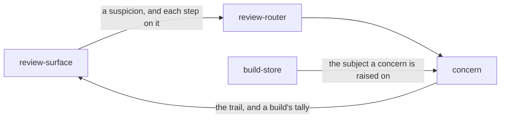

# Concern

«service»

## Responsibility

Keeps what reviewers suspect about a **subject** — a title, a place on the
render, the evidence they pointed at and a hypothesis — and every step it takes
from open to investigating to resolved, apart from any **decision** on the same
subject.

## Bounded context

[Review](../../DOMAIN.md#review)

## Inputs and outputs

In: a build the subject was reported in, the subject, a title and the name of
the person raising it; optionally a region, evidence, a note, a hypothesis and
the state it starts in. A step takes the state it moves to and a name.

Out: the concern with its whole trail, the concerns standing on a subject or
seen in a build, and a tally of a build's concerns by state.

## Depends on

- [`build-store`](../build-store/README.md) — the subject row a concern must be
  raised on, so a concern cannot name a render nobody uploaded

## Used by

- [`review-router`](../review-router/README.md) — the concern routes
- [`review-surface`](../review-surface/README.md) — the concerns card, and the
  count on a build's header

## Boundary

A concern never decides. An approval does not resolve one and a resolution does
not approve anything: a reviewer who accepted a baseline while still suspicious
of it has two answers, and folding them into one loses the doubt the moment the
baseline moves.

A concern is anchored to the subject, not to the build it was raised in. It is
shown on every later build that reports the subject until somebody resolves it,
and the retention sweep does not remove it — a suspicion that expired with its
build would be a suspicion nobody followed up.

Raising, moving and reading are the review credential's, as deciding and the
rest of the review surface are: a concern is what a person wrote, and the
ingest credential lives where a failing job prints its environment.

The trail is append-only. A concern's state is its latest step, and a reopened
concern keeps the resolution it was reopened from.

## Implementation coordinates

- `packages/tribunal/src/concerns.ts` — `createConcernStore`: the refusals, the
  trail, and the tally joined by build rather than by a subject list
- `packages/tribunal/src/concern-types.ts` — the shapes the routes and the
  client share
- `packages/tribunal/src/worker-concerns.ts` — the routes and which credential
  each requires
- `packages/tribunal/src/migration-steps-later.ts` — the tables and the
  triggers that make the trail append-only in the database
- `packages/tribunal/src/ui/concerns.tsx`, `packages/tribunal/src/ui/concern-form.tsx`
  — the card on a subject page and the form behind *Looks suspicious*

## Diagram

