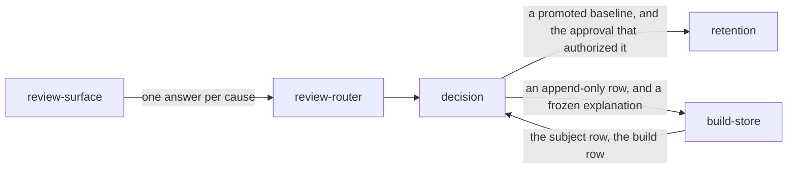

# Decision

«service»

## Responsibility

Records one person's answer for one **subject** in one build and, when the answer
is yes, promotes the **candidate** that run already uploaded.

## Bounded context

[Review](../../DOMAIN.md#review)

## Inputs and outputs

In: a build, a subject, an answer, the name of the person giving it, and
optionally their sentence about why.

Out: the recorded decision. On an approval it also writes a **baseline** through
[retention](../../retention/README.md)'s store, and one changelog row explaining
why that baseline is what it is.

## Depends on

- [`build-store`](../build-store/README.md) — the subject row a promotion is
  built from, and the build row its explanation is frozen from
- [retention](../../retention/README.md) — the store the promoted **baseline** is written through

## Used by

- [`review-router`](../review-router/README.md) — the one subject route that writes
- [`review-surface`](../review-surface/README.md) — what a press settles

## Boundary

Deciding is not writing. The credential that may upload evidence and the
credential that may decide it are two secrets and may never be the same value,
and this is the operation that argument exists for: approving promotes a
baseline every later run is compared against, so anything that can read a build
log must not be able to do it.

Nothing here renders, measures or defaults a field. Every part of the promoted
baseline comes from what the run uploaded — the bytes from the object store, the
digest and the dimensions from the subject row, the **renderer identity** from the
build. A subject whose candidate was never uploaded therefore cannot be decided
at all, and a build carrying no readable identity is refused rather than filed
under a machine nobody can name: the only way to fill either gap would be to
paint an image now, and an approval whose image nobody reviewed is worse than no
approval.

Promotion precedes the record of it. The other order can leave an approval on the
page whose baseline was never written, and the next run reports the same change
again with the reviewer's name already against it.

Nothing is written for a rejection. It is recorded as a decision, but no baseline
changed, and a changelog carrying rejections would answer *why does this baseline
look like this* with entries about baselines that are not there.

A candidate carries the whole render, so a subject where something else also
moved is named before the press rather than settled quietly — the other causes
riding in the same image are listed by component beside the button. A shape-wide
acceptance that refuses such a subject by name belongs to the local acceptance
path, which is [report](../../report/README.md)'s.

## Implementation coordinates

- `packages/tribunal/src/review.ts` — `decide`: the refusal for a subject a build
  never reported, the promotion, the frozen explanation, and then the append-only
  row. `buildContext` reads the commit and the intent at approval time rather than
  joining them later
- `packages/tribunal/src/review-write.ts` — `promote`, which is what local
  acceptance means when it is a click; `store`, the one write on the way in
- `packages/tribunal/src/changelog.ts` — `recordApproval` and `readChangelog`. The
  regions, the commit, the intent and the reviewer are copies rather than a join,
  because the build expires and the explanation of a baseline has to last exactly
  as long as the baseline. Shapes are grouped when somebody reads, so an approval
  spread across three sessions reads as one change, and approvals nothing could
  attribute are returned rather than dropped
- `packages/tribunal/src/migration-steps.ts` — the triggers that make the record
  append-only in the database, so a reversal has to be a second row and a direct
  statement against the database is refused too

## Diagram

