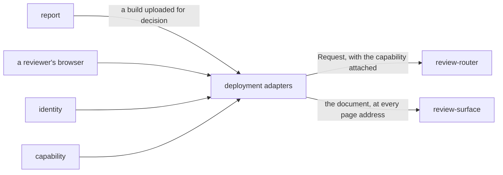

# Deployment adapters

«adapter»

## Responsibility

Wires the one handler to a runtime — a platform worker, a framework route, or a
socket — without changing a route, a refusal or a status code.

## Bounded context

[Review](../../DOMAIN.md#review)

## Inputs and outputs

In: a runtime's own request shape, the deployment's configuration, and the
operator's answer to *which **capability** is this caller allowed*. Out: the
runtime's own response shape, and the addresses the review surface is served at.

A mount strips its own prefix — the handler knows only its own paths — and
replaces the incoming authorization with the token that answer implies.
Replaces, so a caller that sent its own bearer cannot choose its own capability
and the policy stays binding rather than advisory. A refused caller is answered
before the handler ever sees the request, which keeps the host's session and the
deployment's secrets two separate things and asks neither to be the other.

## Depends on

- [`review-router`](../review-router/README.md) — the handler being mounted
- [`capability`](../capability/README.md) — the construction-time refusals, and
  the token a granted capability implies
- [`identity`](../identity/README.md) — the answer that makes a caller a person
  rather than a machine
- [`review-surface`](../review-surface/README.md) — the document served at every page address

## Used by

Nothing in this block.

## Boundary

They add no route, no refusal and no status code. Every one of the three is the
same code in each of them, and the two storage bindings are declared as the
narrow structural subset actually used rather than imported from a platform's
type surface — so the store is exercisable in an ordinary test process, with no
container and no account.

They hold the secrets and hand out none. The handler exposes one method and
cannot be asked for its own tokens, so the tokens are passed to a mount
explicitly.

They do not fail a deployment silently. Construction happens inside the request
so that a token too short or two tokens the same reaches the operator as a
sentence in a response body rather than as a platform error somebody has to go and
find, and a binding pointing at nothing is refused by name instead of surfacing as
a type error on the first request that happens to touch it.

They differ in exactly one thing, and it is stated: a file has an exclusive lock
and one writer, so the file-backed deployment applies and migrates its shape on
start. The platform deployment never migrates on a request, because there is no
advisory lock to serialize one running under concurrent load.

## Implementation coordinates

- `packages/tribunal/src/bindings.ts` — the two storage interfaces, named in full
  in one file, with their construction-time shape checks
- `packages/tribunal/src/worker-entry.ts`, `packages/tribunal/wrangler.jsonc` —
  the deployable module and its declared bindings; the only file in the package
  that reads an environment
- `packages/tribunal/src/next.ts` — `createTribunalRoutes`: the prefix strip, the
  header replacement, and the three method exports a framework route file wants
- `packages/tribunal/src/node/serve.ts` — the socket conversion, the body ceiling,
  and the reuse of the same mount so two hosts cannot answer differently
- `packages/tribunal/src/node/bin.ts` — the executable, configured entirely by the
  environment; `readConfig` is pure so every refusal is exercisable without
  binding a port
- `packages/tribunal/src/node/database.ts`, `bucket.ts` — a file and a directory
  behind the two interfaces, each object written through a staging name so a
  reader never sees half of one
- `tribunal-cloudflare/app/tribunal.ts`, `tribunal-cloudflare/app/env.ts`,
  `tribunal-cloudflare/app/api/[[...path]]/route.ts`,
  `tribunal-cloudflare/wrangler.jsonc` — the deployed console

## Diagram

