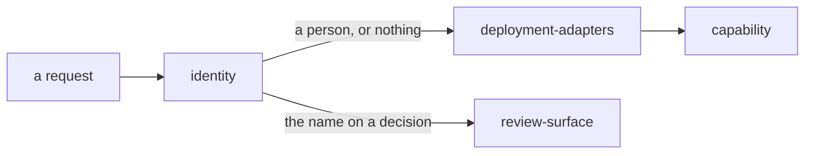

# Identity

«gateway»

## Responsibility

Establishes that a request comes from a named person, so that a decision made
through the surface can carry a name.

## Bounded context

[Review](../../DOMAIN.md#review)

## Inputs and outputs

In: a request, and the deployment's identity configuration. Out: a name, or
nothing — and nothing means the surface is not drawn.

On a network deployment the assertion is a signed token, taken from the header or
the cookie a browser navigation carries, and verified against the provider's
published keys — including the audience, compared against this application's own
tag, so a token minted for a neighbouring application in the same team is
refused. A settable header is never trusted, because an origin reachable beside
its gate turns that header into a request header like any other.

## Depends on

Nothing in this block. It reads the request and the deployment's configuration.

## Used by

- [`deployment-adapters`](../deployment-adapters/README.md) — the answer that
  becomes a reviewing **capability**
- [`review-surface`](../review-surface/README.md) — the name written on every decision

## Boundary

It authenticates a person and never a machine. A credential that authenticates a
machine carries no name, and a token holder is refused here rather than given
one: a rendered review surface has to put a reviewer's name on a decision, and a
capability has none to give.

It holds no accounts. Absent configuration is refusal, never a
default — with no configured identity source, nothing can tell one visitor from
another, and the approve button stays undrawn rather than falling back to
anonymous. There is likewise no anonymous read-only view, because the only thing
that would buy is a second code path that has to stay in step with the first
about which evidence is public, and none of it is.

On a loopback bind it asserts nothing and takes the operator's word: anything
that can open a loopback socket is already running as the person who started the
process, and asking them to paste their own secret back to themselves buys
nothing. On a bind reachable from off the machine the surface is not served at
all — there would be nothing between an approve button and the internet.

## Implementation coordinates

- `tribunal-cloudflare/app/access.ts` — `identify`, `tokenOf`, `verify`,
  `published`; the per-isolate key cache, and the failure that is not cached as
  *this team has no keys*
- `tribunal-cloudflare/app/env.ts` — `ACCESS_TEAM_DOMAIN` and `ACCESS_AUD`, whose
  absence means no review surface
- `tribunal-cloudflare/app/page.tsx` — rendered per request, because who is asking
  is a per-request fact
- `packages/tribunal/src/node/bin.ts` — `LOOPBACK`, `authorizeFor`,
  `TRUST_NETWORK_VARIABLE`, and `REVIEWER_VARIABLE`, which defaults to the user
  running the process
- `packages/tribunal/src/node/serve.ts` — `reviewer`, carried into the served page

## Diagram

