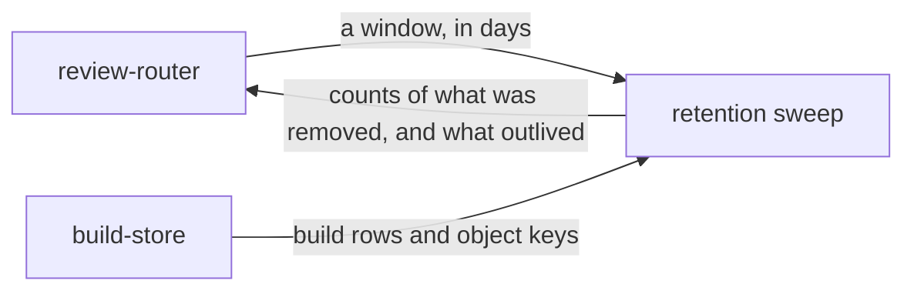

# Retention sweep

«service»

## Responsibility

Removes builds older than a stated window on request, and reports exactly what it
removed.

## Bounded context

[Review](../../DOMAIN.md#review)

## Inputs and outputs

In: a number of days of builds to keep. A value that is not a window is refused
by name rather than treated as zero, because zero keeps none.

Out: counts — builds, subjects and objects removed — beside a fourth number that
is not a removal at all: how many **approvals** outlived the builds this call
took away. An operator who cannot see what a sweep removed cannot tell a working
retention policy from one deleting a build a day.

## Depends on

- [`build-store`](../build-store/README.md) — the build rows and the object keys a window covers

## Used by

- [`review-router`](../review-router/README.md) — the one path that performs it

## Boundary

It runs on request only. Nothing here invents a schedule the operator did not
ask for; wiring it to a scheduled trigger, calling it from a job, or never
calling it are all the operator's decision, and a platform with no timer is not a
reason to grow one here.

It removes what a build kept to be *looked at*, and nothing else. Promoted
baselines are what the next run compares against; decisions carry a person's
name; the changelog is why a baseline is what it is. None of the three is
swept, and the record's append-only triggers would refuse it if this tried.

It is not a general expiry mechanism for the record kept over time — how long
observations, **churn** and **drift** live is [retention](../../retention/README.md)'s
question, not this window's.

## Implementation coordinates

- `packages/tribunal/src/review.ts` — `sweep`: the cutoff, the object deletions
  before the row deletions, the per-table removals, and the count of decisions
  that outlived
- `packages/tribunal/src/worker.ts` — the sweep path, which requires the deciding
  **capability** and reports rather than performing silently
- `packages/tribunal/src/node/bin.ts`, `packages/tribunal/src/worker-entry.ts` —
  the configured default window, which falls back rather than sweeping everything
  when the value is not a positive number

## Diagram

