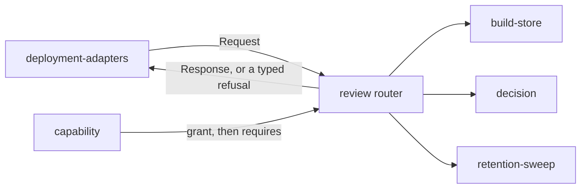

# Review router

«handler»

## Responsibility

Answers every request this deployment serves — authenticated before anything is
parsed, capability-checked after a route is chosen — and turns each refusal into
a typed status rather than an empty answer.

## Bounded context

[Review](../../DOMAIN.md#review)

## Inputs and outputs

In: an HTTP request carrying a bearer credential. Out: a response, or a typed
refusal — a malformed argument is 400, a capability that may not do this is 403,
a method the path does not serve is 405, a lineage conflict is 409, an operation
that cannot be carried out is 422, and a platform that could not be reached is
500. None of them is a value. Every client in this project turns a non-2xx into a
thrown error precisely so a broken service cannot become the sentence *no
baseline* or *nothing has drifted*.

The review paths it owns are the build list, one build, one **subject**'s
decision, one subject's before, after and difference images, the changelog, and
the sweep. Beside them it re-serves the **baseline** and record protocols so a
run configured with a URL and a reviewer's browser reach one address.

## Depends on

- [`capability`](../capability/README.md) — which secret was presented, and
  whether it may do what the path requires
- [`build-store`](../build-store/README.md) — the build list, one build's
  **docket**, and the bytes behind an image address
- [`decision`](../decision/README.md) — the one answer a subject route records
- [`retention-sweep`](../retention-sweep/README.md) — what the sweep path performs

## Used by

- [`deployment-adapters`](../deployment-adapters/README.md) — the single handler each runtime mounts

## Boundary

It does not decide who a caller is. It reads a credential and never a name, and
the mapping from a person or a session to a capability happens above it, in
[`deployment-adapters`](../deployment-adapters/README.md), on
[`identity`](../identity/README.md)'s answer.

It does not own the **baseline** or record protocols it answers on — those are
[retention](../../retention/README.md)'s, restated here so that the paths cannot
drift from a client's, and asserted against the originals rather than hoped
equal.

It makes no outbound request of any kind, and it applies no schema.

The typed refusals above are what a caller who presented a valid credential gets.
Before that check passes it never varies its answer at all — a wrong token, a
missing token and a path that does not exist get one identical sentence, because
any variation between the three is an oracle.

## Implementation coordinates

- `packages/tribunal/src/worker.ts` — `createTribunal` builds the surfaces and
  returns the handler; `route` is the whole path table; `readable` is the named
  exception for the record questions either capability may ask
- `packages/tribunal/src/worker-http.ts` — `BadRequest`, `Forbidden`,
  `MethodNotAllowed`, and the argument readers
- `packages/tribunal/src/worker-input.ts` — the body readers each route validates
  through

## Diagram

