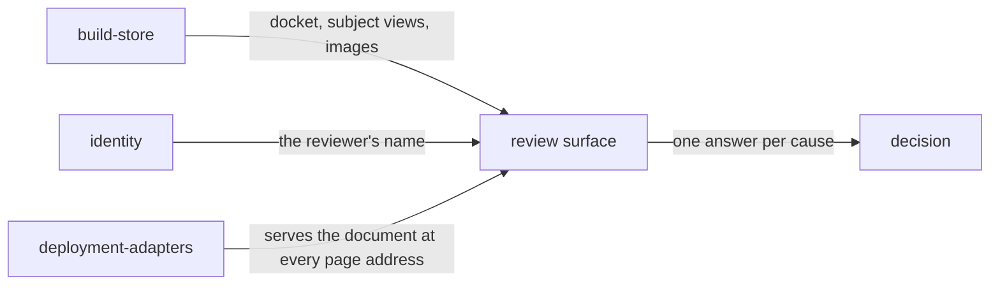

# Review surface

«handler»

## Responsibility

Draws a build for a person — causes first, regions on the render second, the
images last — and collects the answer under that person's name.

## Bounded context

[Review](../../DOMAIN.md#review)

## Inputs and outputs

In: the **docket**, one **subject**'s view, the images, and — on request, one
subject at a time — **churn**, **recurrence** and **drift** from the record. Out:
one decision per cause, and the reviewer's name on it.

Each page is an address, so a change can be linked to a colleague, opened in two
tabs, returned to, and reached with the back button. One address table is read
from both ends — the browser turns a path into a page with it, the host decides
which paths get the document with it — because two lists drift silently in the
worst direction, into a link the client renders and the host answers with a 404.

## Depends on

- [`build-store`](../build-store/README.md) — the docket, the subject views, and the images
- [`decision`](../decision/README.md) — what a press settles
- [`identity`](../identity/README.md) — the name written on every decision

## Used by

- [`deployment-adapters`](../deployment-adapters/README.md) — the page a host
  serves at its own addresses

## Boundary

It holds no credential. The browser calls its own origin with nothing at all and
the host attaches whatever **capability** its own policy granted. Neither
the served document nor any startup line ever carries a secret's value.

It derives nothing. The ordering it draws comes from the tier that has
provenance — **cause** is a field on a region rather than a guess made here —
and the ranking is by cause pixels, because ranked by area a container that was
never edited and only reflowed outranks the edit that moved it.

It refuses to look complete when it is not. Two numbers are drawn as missing
rather than as zero: a flake rate is absent until a run has read every subject
twice, and a coverage that was never stated is unknown rather than clean. It will
not say a render carries only this change when nothing compared its component
hashes — a baseline without them answers *not read*, and reading that as *nothing
else is here* is the reassurance this surface must never give.

It does not tidy up after a failure. A batch decision that fails partway leaves
the answers already written written: rolling back would undo decisions a person
made, to recover from a network error.

## Implementation coordinates

- `packages/tribunal/src/ui/review.tsx` — the router, and the argument for the
  ordering
- `packages/tribunal/src/ui/route.ts` — the address table, disjoint from the API
  paths by construction, with identifiers encoded because a subject has slashes
  in it
- `packages/tribunal/src/ui/docket.tsx`, `change.tsx`, `subject.tsx`, `run.tsx`,
  `viewer.tsx`, `history.tsx` — the pages
- `packages/tribunal/src/ui/carried.tsx` — the other causes riding in the same
  candidate, named before the press
- `packages/tribunal/src/ui/client.ts` — the JSON client, where every non-2xx
  throws rather than becoming an empty list
- `packages/tribunal/src/node/ui-assets.ts` — the document that loads it, with the
  endpoint and the reviewer name as configuration and no token
- `tribunal-cloudflare/app/review.tsx` — the deployed console's mount

## Diagram

