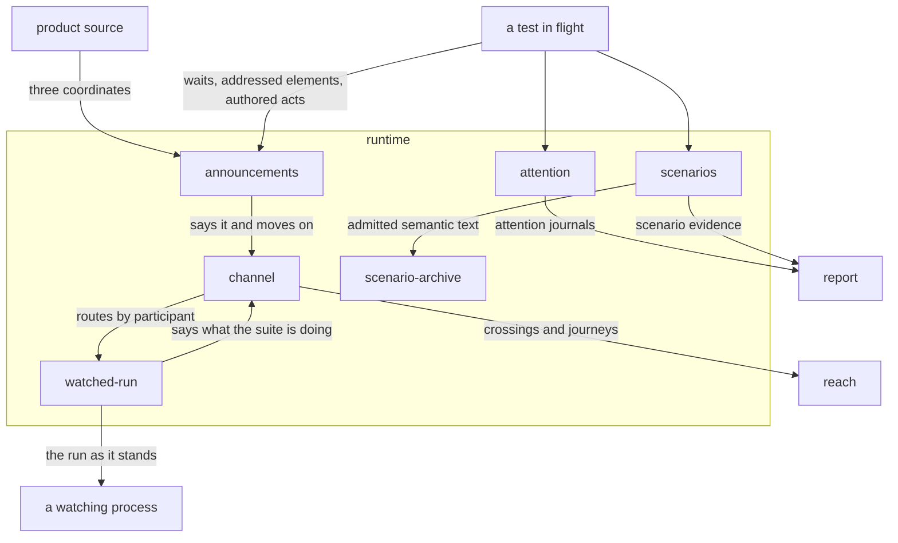

# Runtime

## Responsibility

Carries what running software says about what it is doing out of the process
holding it, while that process is still alive.

## Logical role

The root reads a **subject** off a screen, and a screen cannot say when a
decision was taken, which execution produced it, which element a test meant, or
which path a run walked to arrive. This block is the other source: the software's
own account of itself, taken while the process holding it is still alive, so
timing, execution identity, authorship and path are evidence rather than
inference.

## Boundary

Nothing here decides anything and nothing here observes a **subject**: it writes
no **verdict**, no **baseline**, no **approval**, no history row and no exit
code, and it neither captures, normalizes nor rasterizes. Nothing on a default
path is written down — an announcement is worth something for the length of one
execution and nothing afterwards, and the
[scenario archive](./scenario-archive/README.md) is the one component that keeps
anything.

## Technology

TypeScript on Node 22, in three realms at once: product source that calls three
functions and imports nothing under production, page source installed as strings
before the application's first script, and driver-side listeners on an ephemeral
loopback HTTP port. Execution scope in a service is `AsyncLocalStorage`.
Attribution is read from React's fiber tree, and the driver adapter is a set of
Playwright fixtures.

## Implementation coordinates

- `packages/event/` — the announcement triple, the page and head sinks, the log
- `packages/wire/` — the channel, its three resolutions, and the driver's listener
- `packages/vantage/` — the observatory, the watched-test state, the run's voice
- `packages/eyes/` — attention, the page agent, the attention archive
- `packages/scenario/` — definitions, executions, the fold, the assessment, the archive
- `packages/playwright-test/src/wire.ts`, `packages/playwright-test/src/events.ts`,
  `packages/playwright-test/src/vantage.ts` — how a suite becomes a participant

## Communicates with

- → [`reach`](../reach/README.md) — witnessed crossings, and the journeys that
  connect an execution in one process to a subject in another
- → [`report`](../report/README.md) — a suite in flight, attention journals and scenario evidence

## Uses

### [reach](../reach/README.md)

#### Why

An execution that entered a region of source in one process and painted a
subject in another has to be one fact, and only a carried identity makes it one.
This block owns the carrying, in [`channel`](./channel/README.md), and refuses to
own the conclusion. The tradeoff accepted is that everything
downstream of a lost account is silently narrower, which is why accounts are
acknowledged and announcements are not.

#### What I need from it

The rule that a **journey** is bounded by its execution rather than by a time
window, and is carried as one identity where it crosses a process; the rule that every participant a run declares must report at least once
and that silence does not narrow but retires every observation in the run; and
the traversal that turns **crossings** into a narrowed plan.

#### What would make me leave

A selector that derived execution identity from timing or from a participant's
own claim, which would make the carried identity decorative and the loopback
refusal pointless.

### [report](../report/README.md)

#### Why

Attention journals and scenario assessments are evidence, and evidence that
formats itself has decided who reads it. Handing them to a format owned by
neither its writer nor any of its readers is what lets one journal serve a
person, a change proposal and an agent without this block growing a renderer.

#### What I need from it

A versioned artifact that carries attention journals and scenario evidence with
their incompleteness intact — a partial journal states why it is partial, and
**unobserved** never renders as clean.

#### What would make me leave

A format that dropped the completeness declaration, or that re-derived a
digest or a divergence while rendering, which would make the reading a second
opinion rather than a rendering.

## Components

| Component | Responsibility |
|---|---|
| [announcements](./announcements/README.md) | Carrying the moment the code decided something out to the run, and holding what the run heard |
| [channel](./channel/README.md) | One way home for whatever a process under test has to say, whichever realm it is in |
| [watched-run](./watched-run/README.md) | Holding what a suite is saying in a process that outlives any one test |
| [attention](./attention/README.md) | Which elements a test addressed, in order, with their authorship taken before the tree moved |
| [scenarios](./scenarios/README.md) | One witnessed path through named states, and what comparing two of them says |
| [scenario-archive](./scenario-archive/README.md) | Keeping the semantic text of an admitted scenario under a declared, expiring policy |
| `packages/eyes/src/arguments.ts` | L5 — serializing a query's arguments into plain values |
| `packages/eyes/src/bundle.ts` | L5 — reading the built page-agent bundle off disk |

## Diagram

