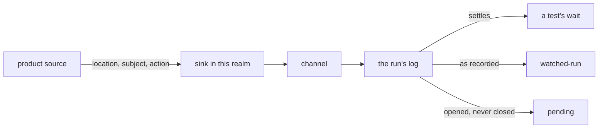

# Announcements

«service»

## Responsibility

Carries the moment the code decided something out of the running software and into
the waits a test puts on it.

## Bounded context

[Runtime narration](../../DOMAIN.md#runtime-narration)

## Inputs and outputs

In: three coordinates from product source — a location, a subject, an action —
in one of three phases. `once` is a moment; `start` and `end` are the two ends of
a process, and they are a pair rather than two moments because *started and never
ended* is a fact a run can report and *no end arrived* is not.

An **announcement** says *when*, never *what*. There is no message, because prose
drifts on one side of the wire and not the other, and no payload, because a
payload invites assertions on data the tree already carries. The what is asserted
the ordinary way, one line later, once the when is settled.

Out: an entry in the run's log, carrying the realm that spoke and its arrival
ordinal — order rather than a clock, because two realms on one machine have two
clocks and no shared one, and a duration is the thing this component exists to
stop a suite asserting on.

Out, to a test: a wait that settles on coordinates already heard as readily as on
coordinates yet to be announced, so a wait written one line too late answers from
the log instead of racing. This is the answer to the assertion a screen cannot
make: **a negative has no timing**. *It does not appear* and *it has not appeared
yet* are the same screen, and no amount of waiting separates them; waiting for
the decision separates them on the first run, with no duration anywhere.

Out, to a run that ends: what a start opened and no end closed, reported as
pending — a better failure than a timeout, because it names the work.

## Depends on

- [`channel`](../channel/README.md) — the way home from whichever realm
  announced, and the ordering that puts *started* before *ended*

## Used by

- [`watched-run`](../watched-run/README.md) — told about each announcement and
  each remark as it is recorded, so a second reader sees what a wait consumed

## Boundary

Told nothing, it installs nothing. The call in product source is a property read
and a return, which is the whole reason these live in product source rather than
in a wrapper a test build swaps in: an announcement present only under test
announces the test harness, not the decision. The same holds in a service, where
an unset variable means no sink and no cost.

Nothing a listener does can reach the code it listens to. A sink that throws is
swallowed at the announcing side: a bug in a test harness in
another process may not become a bug in the application that shipped. What a
swallowed failure produces is a wait that times out and prints what it did hear,
which is a diagnostic in the process where somebody is already reading.

It classifies nothing. An announcement is not a **verdict**, is not compared
against a prior run, and is never written to disk.

It does not scope itself. In a service, an announcement belongs to the execution
the request belongs to, and the execution comes from the [`channel`](../channel/README.md)
rather than from a clock: a request carrying neither an execution nor an address
is one the run did not drive, and announces to nobody.

## Implementation coordinates

`packages/event/src/index.ts` — `vae`, `vaStart`, `vaEnd`, the `EVENT_SINK`
global, and the swallowed throw. `packages/event/src/log.ts` — the driver's log,
`happened`, `finished`, `saw`, `pending`, and the second reader's hooks.
`packages/event/src/head.ts` — `collectEvents`, the async-context execution
scope, and `enter`. `packages/event/src/page.ts` — `eventCollectorSource`, the
listener a driver evaluates before navigation, which holds what was said before
a carrier existed. `packages/playwright-test/src/events.ts` — the driver half.

## Diagram

