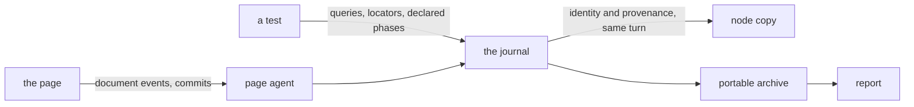

# Attention

«service»

## Responsibility

Records which elements a test addressed, in the order it addressed them, with
their authorship taken before the rendered tree moved.

## Bounded context

[Runtime narration](../../DOMAIN.md#runtime-narration)

## Inputs and outputs

In: the test surface the adopter already owns. A query resolving, being absent,
or throwing; a locator planned and later consumed as an action, a read or an
assertion; a document event arriving at a capture-phase listener installed before
the application could receive it; a commit the rendering library performed; and
the arrange, act and assert boundaries the test author declares.

Out: one ordered journal per test, and a portable archive of journals for a
reader in another process. Each entry carries a copy of the node's identity —
its element name, its role, its test id, its accessible name — and its
**provenance**, taken in the same synchronous turn. The rendering library deletes
its attribution expando on unmount, so the copy holds no live node reference:
delaying the read and retaining the node is not the same operation.

A journal declares whether it is complete, and an incomplete one says why. A
locator's pre-operation read is present even when it found nothing, because
measured-and-empty and never-measured are different answers.

## Depends on

Nothing in this block. It reads the rendered tree in the realm the test is in.

## Used by

- [`report`](../../report/README.md) — attention journals, rendered for whoever is reading

## Boundary

Initiating an update, performing work, being addressed by a test and being
executed are four distinguishable facts, and this component may not collapse
them. A component that scheduled a state change is not the component that
rendered because of it, and neither is the element a test named.

Identity is a structural path, never a display name, which is the whole
reason a finding survives the build it was found in.

It infers no phase. An arrange, act or assert boundary is recorded because the
author declared it, never guessed from which library call came next.

It owns no runner lifecycle. It exports no test and no assertion surface, it
installs no testing library, and it mutates the query object the suite already
holds rather than replacing it — the locator proxy preserves chaining, so the
suite keeps its own matchers. A journal is per-realm and synchronous; who opens
and closes a test is the adopter's.

It draws no conclusion. It says what was addressed, not whether the addressing
was right, and it compares nothing to anything.

## Implementation coordinates

`packages/eyes/src/access.ts` — the attention union, the journal, the archive and
its completeness rule. `packages/eyes/src/snapshot.ts` — `snapshotNode`, the
same-turn copy. `packages/eyes/src/page-agent.ts` — the page-realm half installed
before the application, and the events it listens for.
`packages/eyes/src/rtl.ts` and `packages/eyes/src/playwright.ts` — the two
adapters. `packages/eyes/src/playwright-proxy.ts` — the chain-preserving locator
proxy. `packages/eyes/src/archive.ts` — validation at the process boundary.

## Diagram

