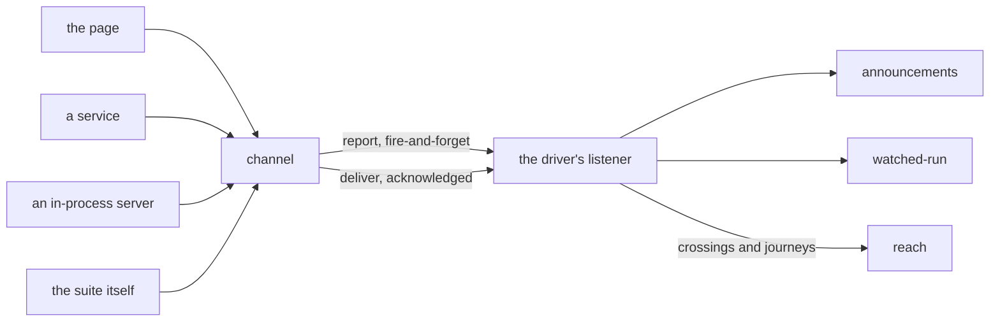

# Channel

«gateway»

## Responsibility

Gives a process under test one way to answer the run that started it, whichever
realm it is running in.

## Bounded context

[Reach](../../DOMAIN.md#reach)

## Inputs and outputs

In, at the participant's end: whatever the request carried. A **journey** and a
return address travel side by side on cookies rather than one inside the other,
so a participant that only announces need not parse a coverage key to find its
way home. From that, three resolutions, and the caller writes the same line for
all three:

1. A carrier installed on the global by the driver — the page, and equally a
   server the suite started in-process. The report is a function call and there
   is no hop.
2. A return address the driver left on a cookie and the request carried in — a
   service in another process. The report is a POST to loopback.
3. Neither, which is a request the run did not drive. It reports to nobody, which
   is honest and is not an error.

A participant handed an address by its environment rather than sent one goes to
that address directly, because resolving through the carried path would prefer
whatever sink is installed in its own realm — which for a driver is its own desk.

In, at the driver's end: reports on an ephemeral loopback port, one address per
execution, routed on which instrument is speaking and nothing else.

Out: **crossings** and **journeys** to [`reach`](../../reach/README.md), and
announcements and run reports to the components above.

Two guarantees, because the instruments fail in opposite directions.
Reporting is fire-and-forget: a lost announcement is a wait that times out and
prints what it did hear — loud, in the driver, in front of somebody already
reading a failure. Delivering is acknowledged and retried and rejects when it
finally cannot: a lost account is a subject skipped in silence on the next run,
wrong in the direction that hides a defect. Order on one channel is preserved,
which is the only ordering property anything above rests on.

## Depends on

Nothing in this block.

## Used by

- [`announcements`](../announcements/README.md) — the way home from whichever
  realm decided something
- [`watched-run`](../watched-run/README.md) — the same medium, with the suite
  reporting and a watcher listening

## Boundary

Only a loopback `http` address is accepted: the address is written by whoever is
talking to this process, so
a participant that posted wherever a cookie said would be a way to make it fetch
an origin somebody else chose. An address handed over by an environment is
guarded exactly as a carried one is.

A **journey** is bounded by its execution, never by a time window. One opaque
identity per execution, minted by the driver, and the identity is in the address rather than in the body: a
participant repeats nothing it was told and the driver reads back the key it
minted itself, so a report cannot claim an execution by writing one down. The
subject's name never leaves the driver, so a participant never learns what it is
being observed for.

It interprets no body. A body a listener cannot parse is answered as a refusal
rather than thrown on, so a participant that acknowledges its reports learns it
lost one, and a listener never takes the run out on an observer's behalf.

It keeps nothing. There is no report directory, no file to clean up and no
artifact to mistake for evidence later, and a listener is never a reason for a
process to stay alive.

It does not decide what silence means. That every participant a run declares must
report at least once, and that silence retires every observation in the run
rather than narrowing it, is [`reach`](../../reach/README.md)'s rule, enforced
where the narrowing happens.

## Implementation coordinates

`packages/wire/src/index.ts` — `channelFrom`, `channelTo`, `report` against
`deliver`, the loopback guard, `JOURNEY_COOKIE`, `RETURN_COOKIE`, `WIRE_SINK`,
and the `Participant` union the driver routes on.
`packages/wire/src/listen.ts` — `listen`, `addressFor`, the in-realm carrier,
`installCarrier`, and `wireCarrierSource`.
`packages/playwright-test/src/wire.ts` — one listener per worker.

## Diagram

