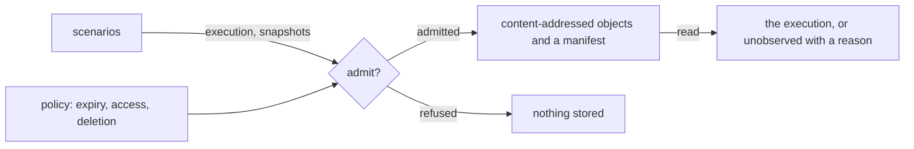

# Scenario archive

«repository»

## Responsibility

Keeps the semantic text of an admitted scenario execution, content-addressed,
under a policy that declares who may read it and when it stops existing.

## Bounded context

[Runtime narration](../../DOMAIN.md#runtime-narration)

## Inputs and outputs

In: an address naming the project, the run, the scenario, the execution, the
precondition, the **profile** and the attempt; a witnessed execution; and a
policy. The policy carries an instant after which the evidence is unavailable, a
declaration of who may read the retained text, a declaration of how it is
deleted, and an admission decision taken per **semantic snapshot** — so what is
kept is a choice the adopter makes about each object rather than a default.

Out: a manifest holding the retention envelope, the definition, the execution and
the content addresses of the snapshots it referred to, with the snapshots stored
as objects beside it under those addresses.

Out, on reading: either the execution with its snapshots, or the statement that
it is **unobserved** with the reason.

## Depends on

- [`scenarios`](../scenarios/README.md) — the witnessed execution and the
  semantic objects it referred to

## Used by

Nothing in this block. An adopter opens it.

## Boundary

It accepts semantic objects and a manifest, and nothing else: no **raster**, no
render document, no announcement body, no **baseline**, no **approval**, no
history row and no exit code. There is no call on it that could write one.

An expired or missing object is **unobserved**, never reconstructed and never
approximated from what remains. A policy whose retention has already elapsed is
refused rather than stored, and collection of expired evidence is a call
somebody makes rather than a background sweep.

It is on no default path. Nothing in an ordinary run opens it.

It decides nothing about what it holds. It compares no two executions, folds no
machine and derives no state; it stores what it was handed under the address it
was handed.

## Implementation coordinates

`packages/scenario/src/archive.ts` — `createScenarioArchive`, the admission
policy, the address validation, the manifest shape, `put`, `read` and
`collectExpired`.

## Diagram

