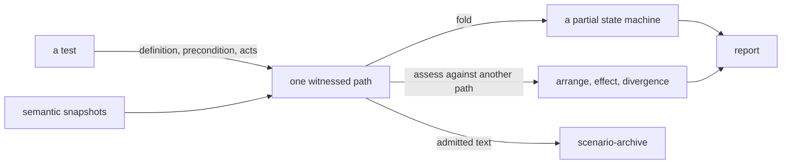

# Scenarios

«service»

## Responsibility

Records one witnessed path through named states — a precondition, authored
**acts**, and the state each act arrived at — and says what comparing two such
paths shows.

## Bounded context

[Runtime narration](../../DOMAIN.md#runtime-narration)

## Inputs and outputs

In: a definition naming acts by stable authored key; a precondition that is
itself a named **subject** with the **profile** that read it; and one observation
per frame, which is either a **semantic snapshot** or an explicit refusal
carrying at least one diagnostic. The link from a precondition to the subject it
varies is carried as the resolver produced it rather than re-parsed here.

Out, from one execution: a frame per act, each holding the content address of the
state it arrived at and of the snapshot that state was read from. An execution
that became unobserved refuses to record another act, so a path never continues
past the point where it stopped being witnessed.

Out, from many executions: a partial state machine — nodes, the transitions
between them, the acts whose destination was never observed, and the places where
one act from one state reached more than one destination.

Out, from two executions: three comparisons kept separate. Did the two begin
differently; what moved across each act; and at which act the two stopped
agreeing. Each comparison names the **bands** that moved, the components that
moved, the bands neither side could observe, and a parting saying which input
made the edge — because a **digest** says an act had an effect and only the
parting says what the effect was.

## Depends on

Nothing in this block. It is handed the snapshots it compares.

## Used by

- [`scenario-archive`](../scenario-archive/README.md) — the run whose semantic text may be admitted
- [`report`](../../report/README.md) — scenario evidence, rendered for whoever is reading

## Boundary

A transition is evidence that a destination followed an act, not proof that it
caused it. Nothing here claims causation, and nothing here inspects what
arranged a world — the collector, fixture, route, story or host produces the
precondition and this records which one was arranged.

Acts align by key and occurrence along their common ordered prefix, and later
occurrences are never shifted into a plausible pair. Alignment stops at the
first act the two executions do not share, and everything after it is reported
unmatched rather than matched approximately. An act's identity is the authored
key; a resolved target or a document event is evidence, never identity.

No unwitnessed edge is inferred. An absent transition is absent, not
impossible, and an act whose destination was not observed is listed as unknown
with the reason rather than omitted.

An effect **digest** is the classified variance across an act rather than the
destination's own hash, so an edit to a shared token moves every state and
leaves every effect stable, and an act that produces a different delta moves.

This is inquiry only. It writes no **baseline**, no **approval**, no history row,
no changelog and no exit code, and it produces no **verdict** — a divergence is
something to read, not something that fails a run. Its values are ephemeral:
dropping one drops the scenario unless it was admitted to the archive.

## Implementation coordinates

`packages/scenario/src/execution.ts` — `defineScenario`, `startScenario`,
`recordAct`, `unobserved`, and the content address of a semantic object.
`packages/scenario/src/contract.ts` — the constructor-owned definition, execution
and run, the frame and outcome shapes, and the variance and parting types.
`packages/scenario/src/machine.ts` — `foldScenarios`, the unknown transitions and
the divergent destinations. `packages/scenario/src/assessment.ts` —
`assessScenarios`, the prefix alignment and the effect comparison.

## Diagram

