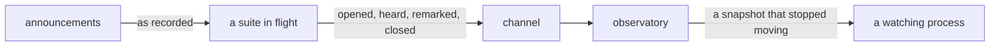

# Watched run

«repository»

## Responsibility

Holds what a suite is saying in a process that outlives any one test, so a suite in
flight is something to look at rather than something to wait for.

## Bounded context

[Runtime narration](../../DOMAIN.md#runtime-narration)

## Inputs and outputs

In: four sentences a run says about one test — it opened, a realm announced
something in it, the listener knows something a wait cannot see, it closed
however it closed. None of them names the test: the execution is in the address
the report arrived on, because a body that named its own test could claim one and
a watcher believing it would attribute an announcement to whichever test the body
asked for. Each sentence is versioned, because the two ends are separately
installed and a watcher drops what it cannot read rather than half-reading it.

Out: a snapshot — plain values that will not change again — carrying every test
held, its title, its file, its worker, its state, everything it was heard to
announce, what opened and never closed, the remarks, and the address reports
arrive on, so a reader with nothing to show can name what to set rather than
leaving somebody to guess it is broken.

The signals are not collected for this. A worker already knows which test is
running, which realms answered it, what opened and never closed, and how it
ended; all of it is spent settling waits and printing failures and then
discarded. This is the second reader, given the same signals at the same moment.

## Depends on

- [`channel`](../channel/README.md) — the same medium, unchanged and unextended,
  with the suite as the participant
- [`announcements`](../announcements/README.md) — told about each announcement
  and remark as the log records it

## Used by

Nothing in this block. A watching process attaches and reads the snapshot.

## Boundary

Nothing is written down. What changes when somebody is watching is only how
long one execution lasts, because the memory holding it belongs to a process that
outlives the test rather than to the test. Stop that process and the evidence is
gone. Nothing is added to the run's own evidence either: a **run report** records
what a run decided, and this records what it *is doing*.

A bounded buffer counts what it dropped. Both the list of tests and the list
of announcements per test drop from the front, and both are counted, because a
reader who cannot tell *nothing was announced* from *the beginning was forgotten*
draws the first conclusion — the one that sends somebody looking for a call that
is right there. Work opened and never closed is reported as pending, and the
tally of it is exact whatever was dropped, because it is what an unfinished run
is actually asked about.

It cannot break its subject. Reporting is fire-and-forget always: a run that
failed because the thing looking at it went away would be worse than no watcher.

It renames nothing. A test's end is spelled in the runner's own words, because a
watcher that renamed them would ask a reader to hold two vocabularies for one
fact. It knows nothing about **subjects**; a suite that never captures anything
reports exactly the same four sentences.

It is not automatic in one direction only: a lifecycle report is sent for every
test so a listing has no holes, and announcements ride a log a test already
opened — a test with no listener still appears, having heard nothing, which is
the true answer rather than a missing one.

## Implementation coordinates

`packages/vantage/src/observatory.ts` — `createObservatory`, the bounds, the
dropped counts, the open-work tally. `packages/vantage/src/watch.ts` —
`openVantage`, `VANTAGE_VARIABLE`, and the one probe that decides an address is
unusable once rather than per report. `packages/vantage/src/attach.ts` —
`attachVantage`, the only half that opens a socket.
`packages/vantage/src/report.ts` — the four sentences and the version guard.
`packages/vantage/src/state.ts` — the snapshot handed to readers.
`packages/playwright-test/src/vantage.ts` — the automatic lifecycle fixture.

## Diagram

