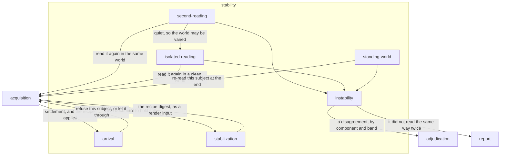

# Stability

## Responsibility

Decides whether a reading of a **subject** may be trusted at all, before
anything is concluded from it.

## Logical role

The root's controlled comparisons all rest on one assumption — that a subject
read twice under identical conditions reads the same way — and this block is
the only place that assumption is tested rather than relied on. It supplies the
two **instruments** whose variable is the observation itself: one advances time
and holds the world, the other rebuilds the world and holds time. Everything
else in the system reads a difference as news; here a difference between two
readings that should have agreed is a defect in the evidence, and it is named
with the same vocabulary a real change is named with — component, **band**,
`file:line`.

## Boundary

It does not retry: both outcomes of both **second readings** are reported and
neither clears anything. It decides nothing beyond whether a reading may be
trusted — it does not paint, does not say what a difference against a
**baseline** means, and does not keep the record of how often a subject has read
differently, which belongs to [`retention`](../retention/README.md).

## Technology

TypeScript. Interventions are expressed as injected CSS and as browser
screenshot options; **arrival** is read from React's committed fiber tree
without installing anything; the wire is observed through Playwright's request
routing; the second reading in a held world is a **digest** comparison and never
a rasterization.

## Implementation coordinates

- `packages/core/src/format/stabilize.ts` and `packages/core/src/format/intervention.ts`
- `packages/core/src/attribute/instability.ts`
- `packages/dom/src/stabilize.ts`
- `packages/playwright/src/network.ts`, `packages/playwright/src/blank.ts`,
  `packages/playwright/src/gif.ts`
- `packages/react/src/arrival.ts`, `suspense.ts`, `quiet.ts`, `commits.ts`, `identity.ts`
- `packages/cli/src/commands/again.ts` and `packages/cli/src/commands/alone.ts`
- `packages/raster/src/gate.ts`
- `packages/session/src/`

## Communicates with

- → [`acquisition`](../acquisition/README.md) — a request for a second reading,
  with the world held or rebuilt
- → [`adjudication`](../adjudication/README.md) — a disagreement between two
  readings, to classify by component and band
- → [`report`](../report/README.md) — that a subject did not read the same way
  twice, carried beside its verdict
- ← [`acquisition`](../acquisition/README.md) — whether the subject has arrived,
  and which interventions were applied to hold it still

## Uses

### [Acquisition](../acquisition/README.md)

#### Why

A second reading is an observation, and this block owns no way to take one.
Re-implementing collection here would produce a reading that differs
from the first in more than the one variable being tested, which is the whole
of what these instruments are: exactly one thing changes. The cost accepted in
exchange is that the world is a single standing page, so both second readings
queue through the collector's one lane rather than running beside the first.

#### What I need from it

A subject collected again into the world that is already standing, and — for
the reading that varies the world — a collection into a world built with
nothing else in it. Both must return a document, and a snapshot wherever the
**profile** could take one, because the document proves the disagreement and
only the snapshot can name it. It must also report what it did to hold the page
still, so the recipe folds into the **renderer identity** of what it produced.

#### What would make me leave

A collector that cannot rebuild a clean world states so, and the reading that
varies the world reports that it was not taken rather than inventing an answer.
A collector that could not repeat a collection at all would end the coupling by
ending the instrument.

### [Adjudication](../adjudication/README.md)

#### Why

A disagreement between two readings and a difference against a **baseline** are
the same question asked of two different pairs, and answering them with two
implementations is how the two answers drift. The same comparison that decides
which component moved and in which **band** decides it here, so an
**instability** is stated in the vocabulary a **sensitivity** rule is declared
in and can be absorbed by the same predicate a **verdict** uses.

#### What I need from it

The difference between two snapshots resolved to **component hashes**, the
bands that moved, and the predicate that says whether a subject is asserted on
those bands at all.

#### What would make me leave

Nothing foreseeable.

### [Report](../report/README.md)

#### Why

Two readings answer *did this one run disagree with itself*; only a record
answers *how often*, and *whether the fix that went in last week worked*. This
block produces the first answer and cannot produce the second, because it sees
one run. Putting the finding in the **run report** is what lets it reach the
record without this block owning a store, and it keeps the finding beside the
**verdict** it qualifies rather than behind it — a subject reported green by a
run that also found it unstable is a different object from a subject reported
green.

#### What I need from it

A per-subject field that survives beside the verdict without altering it, and a
shape that carries the component and the **band** that read differently. Not a
count of pixels: a pixel count measures displacement and is machine bound, and
a fix cannot be aimed at it.

#### What would make me leave

A format that folded instability into the verdict, or that could only carry it
as a severity.

## Components

| Component | Responsibility |
|---|---|
| [arrival](./arrival/README.md) | Whether a subject has finished appearing, and refusing one that has not |
| [stabilization](./stabilization/README.md) | The enumerable, named set of interventions that make a subject readable, and the identity they fold into |
| [second-reading](./second-reading/README.md) | Reading a subject twice in the world it is already in, and reporting whether it agreed with itself |
| [isolated-reading](./isolated-reading/README.md) | Reading a changed subject again with nothing else in the world, to separate a component's change from the suite's order |
| [standing-world](./standing-world/README.md) | Many subjects in one world that is never torn down, with cross-pollution detected and attributed rather than prevented |
| [instability](./instability/README.md) | Naming a disagreement by component, band, declaration and line — or stating that it lives below the box tree |
| `packages/playwright/src/gif.ts` | L5 — byte-level truncation of an animated image to its first frame, the codec half of one intervention |

## Diagram

