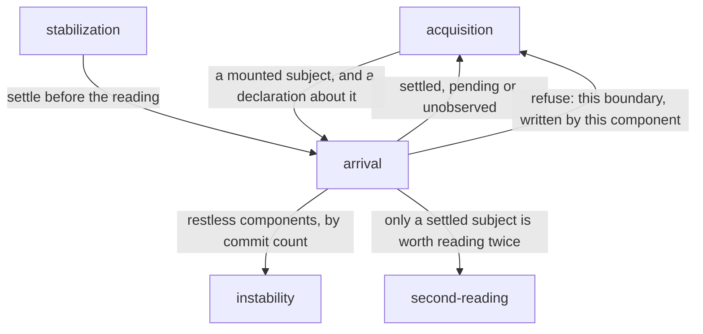

# Arrival

«policy»

## Responsibility

Decides whether a **subject** has finished appearing, and refuses one that
has not.

## Bounded context

[Stability](../../DOMAIN.md#stability)

## Inputs and outputs

In: a node and the React tree under it, read for boundaries still showing a
fallback and for commits still reaching the DOM; and the operator's declaration
of whether this subject is a capture of its own loading state.

Out: three states, never two — settled, pending, and **unobserved** — with how
long was waited, how many boundaries were found, and which of them were still
waiting; and, from those, a refusal sentence or nothing. A page with no React
tree reports unobserved, because a page nobody could look at and a page that
finished arriving are different facts, and conflating them declares every
non-React subject to have waited successfully.

## Depends on

- [`instability`](../instability/README.md) — the vocabulary a still-moving
  subject is named in: the component, not the timeout

## Used by

- [`stabilization`](../stabilization/README.md) — the settle step of a recipe,
  which waits before the reading rather than before the paint
- [`second-reading`](../second-reading/README.md) — a subject that never settled
  is refused before it is worth reading twice
- [`instability`](../instability/README.md) — the components still committing,
  named and counted rather than sampled

## Boundary

A subject still arriving is refused. Not captured, not captured with a warning,
and not waited on longer: a skeleton on a slow machine and a component on a
fast one is a **baseline** every **band** agrees with and nobody wrote, a
warning leaves that baseline in place and the build green, and a boundary that
never resolves is not slow — the timeout is already what tells those two apart.
Every wait added as a remedy is paid by every subject forever, while the fix in
the component is paid once.

The refusal is symmetric, which is what keeps the escape hatch honest. Intent
to read a mid-flight state is declared, and the declaration is checked in both
directions: a subject declared to capture a loading state, that then settles,
is refused too, because a declaration nobody deleted is a subject whose
baseline flips between a skeleton and a component depending on the weather.

It does not decide *why* a page never finished, and it does not fix it. It
names the boundary, the component that wrote it, and the components still
committing, and the fix is made where the markup is.

## Implementation coordinates

- `packages/react/src/arrival.ts` — `awaitSuspense` reads until the subtree is
  clean for a required number of consecutive reads (the waterfall guard, so the
  gap between one fallback leaving and the next arriving is never photographed);
  `suspenseRefusal` turns a settlement into `string | undefined`, so a caller's
  use of it is one `if` and cannot decay into a log line.
- `packages/react/src/suspense.ts` — `boundariesUnder`, which reads a boundary's
  state off the committed fiber and distinguishes resolved, pending and
  dehydrated by traversal, with nothing installed.
- `packages/react/src/commits.ts` and `packages/react/src/quiet.ts` — `tapCommits`
  and `awaitQuiet`: has the page stopped committing, answered as a fact with the
  restless components named and counted, rather than sampled in pixel space.
  The tap is the one reading in the package that needs a hook installed before
  React loads, so an unattached tap reports itself unattached and never zero.
- `packages/react/src/identity.ts` — `markRender` and `remountedSince`, which
  separate a component instance rebuilt since a mark from one appearing for the
  first time.
- `packages/route-collector/src/index.ts`, `packages/storybook-collector/src/index.ts`,
  `packages/playwright-test/src/fixture.ts` — the three surfaces that apply the
  refusal.

## Diagram

