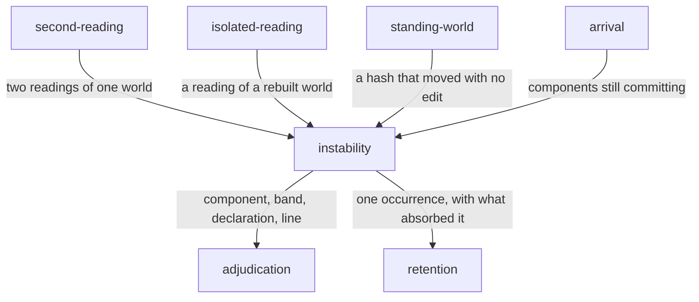

# Instability

«service»

## Responsibility

Turns a disagreement between two readings that were supposed to agree into a
place: a component, a **band**, the declarations that moved, and a line.

## Bounded context

[Stability](../../DOMAIN.md#stability)

## Inputs and outputs

In: two snapshots of one **subject** at one commit, and — when an image
comparison was also taken — whether the pixels differ.

Out: whether the subject was stable, the loudest band that moved, and the
locations ordered by how many deltas landed in each: the component that wrote
the node, the properties with their before and after, a landmark phrase, the
custom property the moving value resolved through, and a conservative reading
of the shape of the evidence where exactly one reading fits. Plus one sentence
stating what moved and what it implies, and the same finding rendered with a
file on the end.

## Depends on

- [`second-reading`](../second-reading/README.md) — supplies the two readings of one world
- [`isolated-reading`](../isolated-reading/README.md) — supplies the reading of a rebuilt world
- [`standing-world`](../standing-world/README.md) — supplies a hash that moved with no code change
- [`arrival`](../arrival/README.md) — supplies the components still committing, by commit count

## Used by

- [`arrival`](../arrival/README.md) — a subject still moving is named by
  component rather than by timeout
- [`second-reading`](../second-reading/README.md) — the naming half of its sentence
- [`standing-world`](../standing-world/README.md) — the vocabulary a confirmed
  order-dependence is stated in

## Boundary

An instability is the finding, not the noise before one. Capturing again until
two readings agree works, and destroys the only evidence that existed: the run
has paid for the extra captures, learned nothing, and will pay again tomorrow.

There is always a cause. In one case there is no place to put it, and that case
is reported as its own kind rather than hidden. When nothing moved semantically
and pixels still differ, the cause is below the box tree — glyph rasterization,
compositing, a font resolving differently — and no component is responsible.
Naming one would be inventing a location. That belongs to the **renderer
identity**, not to the code. *We cannot see it from here* and *nothing is wrong*
are different sentences, and a subject reported stable on the strength of an
image comparison nobody made is the same false negative this system exists to
refuse: an omitted pixel comparison leaves sub-semantic movement **unobserved**,
never absent.

Attribution prefers the component whose markup wrote the node over the nearest
enclosing one, because a fix is made where the markup is written and not where
it ends up. A whole-node delta carries no property, so the kind is what is
consulted and the property list is only ever additive — reading an absent
property as *only geometry moved* would file a changing clock under
displacement.

The shape of the evidence is guessed only where one reading fits and the others
do not, and its absence is the common case and not a failure. A guess that fires
on ambiguous evidence sends somebody to the wrong file with confidence, and the
location and the moved declarations — which are facts — get read as though they
carried the same certainty as the label.

It does not decide a **verdict**, does not gate, and does not keep the record.
An occurrence absorbed by a **sensitivity** rule is a fact about the page rather
than a defect in it, and is still stated, because a declaration nobody re-reads
is how a suite quietly stops watching something.

## Implementation coordinates

- `packages/core/src/attribute/instability.ts` — `locateInstability`,
  `summarizeInstability`, the `InstabilityBand` including `sub-semantic` and
  `none`, and `guess`, narrow.
- `packages/history/src/instability.ts` — the shape one occurrence is recorded
  in: component and frequency band both optional, because a collector that
  supplies documents without snapshots proves the instability and gives nobody
  the means to name it, and the rule that absorbed it, kept rather than dropped.

## Diagram

