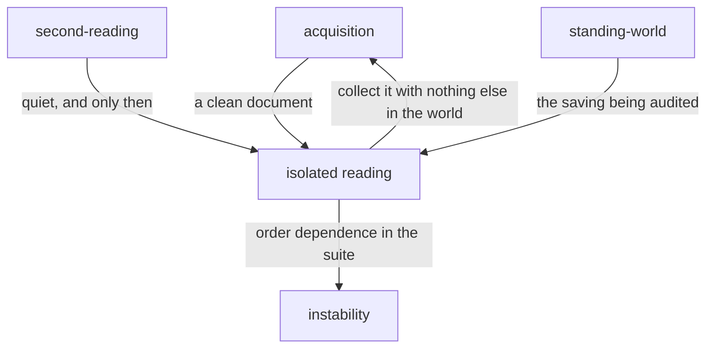

# Isolated reading

«policy»

## Responsibility

Reads a changed **subject** again with nothing else in the world, to separate
a change somebody made to the component from a change the subject that ran
three before it left behind.

## Bounded context

[Stability](../../DOMAIN.md#stability)

## Inputs and outputs

In: a subject whose **verdict** is changed, the observation that reached that
verdict, the identity its **baseline** was found under, and the run's budget.

Out: whether the change reproduced with nothing else in the world, and the
sentence saying which of the two facts that is — a change to the component, or
order dependence in the suite. Absent capability, an exhausted budget, a failed
clean collection and a clean comparison that was neither changed nor unchanged
are four different sentences, and each leaves the change standing rather than
clearing it.

## Depends on

- [`second-reading`](../second-reading/README.md) — runs first, because this
  inference is only valid if two readings of one world would have agreed
- [`standing-world`](../standing-world/README.md) — the saving this exists to
  audit: the world is not rebuilt between subjects

## Used by

- [`instability`](../instability/README.md) — supplies an order-dependent
  finding to be stated against the suite rather than the component

## Boundary

It rebuilds the world and holds time; that neither outcome clears anything is
[the block's rule](../README.md). A change that reproduces alone is still
changed, and one that does not is still a finding — a different one, against the
suite instead of the component.

That inference
— *the clean reading differs from the shared one, therefore the world moved it*
— is only evidence if two readings of one world would have agreed, which is why
it never runs before [`second-reading`](../second-reading/README.md) and is
skipped entirely once that pass has found something: there is nothing left for
it to establish, and a confident sentence about the suite aimed at a bisection
that will never converge is worse than no sentence.

Anything that is not unchanged leaves the change standing. **Incomparable** and
new are folded in: neither is evidence that the change was a leak,
and reporting *does not reproduce* on the strength of a baseline that could not
be read would clear a real regression.

It does not name the subject that poisoned this one. A probe can only see what
it can read, and the causes that actually bite live in module scope, where a
singleton or a cached client is invisible to any amount of photography. The
difference handed over is already resolved to a region, a node, a component and
a file; finding the writer from there is a bisection.

It re-uses the comparison the first pass made, against the same other side, so
the clean-world answer inherits attribution, font reporting and the identity
partition rather than acquiring its own subtly different versions of all three.

## Implementation coordinates

- `packages/cli/src/commands/alone.ts` — `alone`: the budget, the refusals with
  their four distinct reasons, and the clean comparison through
  `observeAgainstBaseline` or `observePair`.
- `packages/cli/src/commands/collector.ts` — `collectAlone`, the optional
  capability whose absence is reported as *write the method* rather than *raise
  the number*.

## Diagram

