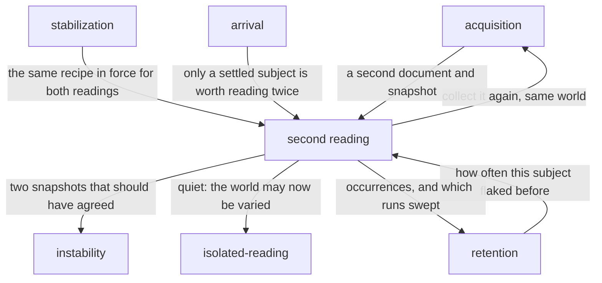

# Second reading

«policy»

## Responsibility

Reads a **subject** twice in the world it is already in, seconds apart with
nothing changed in between, and reports whether it agreed with itself.

## Bounded context

[Stability](../../DOMAIN.md#stability)

## Inputs and outputs

In: a subject already collected once, its **verdict**, the **sensitivity** rule
it declared if it declared one, and the run's investigation budget; or, in a
**sweep**, every subject regardless of verdict.

Out: a **digest** comparison of two documents — and, when they disagree, the
components and **bands** that moved, whether the movement is entirely inside
what the subject is not asserted on, and one sentence saying what the
disagreement means for the verdict that was reached. Three states where a
render decision is being made, never two: stable, unstable, and unknown, since
a single sample proves nothing and reporting it as stable would be a verdict
resting on a comparison nobody made.

## Depends on

- [`stabilization`](../stabilization/README.md) — the same recipe in force for
  both readings, so the only variable is time
- [`arrival`](../arrival/README.md) — a subject that never settled is refused before it reaches here
- [`instability`](../instability/README.md) — naming which component disagreed,
  in which band, at which line

## Used by

- [`isolated-reading`](../isolated-reading/README.md) — its inference is only
  valid on a subject that came back quiet from here
- [`instability`](../instability/README.md) — supplies the two snapshots a
  disagreement is located in

## Boundary

It advances time and holds the world; that neither outcome clears anything is
[the block's rule](../README.md). A third sample could only say how often it
happens, which is not the question — the question is where it comes from, and
the snapshots already carry that.

A leak that
fires on every run never moves between two readings of one world, so this is
blind to precisely what [`isolated-reading`](../isolated-reading/README.md) is
for, and neither substitutes for the other.

It never rasterizes. The comparison is a document digest, at the cost of the
cheap tier against the paint the subject has already paid for, so raster-level
nondeterminism is invisible here. Where the
check runs before the shutter, an unstable subject is not rendered at all: an
image of something that was moving is a baseline that never corresponded to a
state of the product, and every later run compares against it.

Two readings is a lower bound, not a certificate. A subject that reads
differently one time in fifty passes this forty-nine times out of fifty, and an
absent finding means *this run's two readings agreed* and may never be presented
as stability. The rate is not computed here: the denominator of every rate about
instability is **sweeps**, not runs, because a green subject in a normal run was
never asked the question at all — this component produces the occurrences and
marks the runs that swept, and [`retention`](../../retention/README.md) divides.

A subject that declared what it is asserted on has already said which movements
are not its business, and the same predicate the verdict uses decides that here.
A collector that produced a subject once and then could not produce it again has
answered this question in the loudest possible form.

## Implementation coordinates

- `packages/cli/src/commands/again.ts` — `again`: the digest comparison, the
  budget, the sweep mode, the sensitivity absorption, and `movedBetween`, which
  reuses the comparison path's own attribution rather than growing a second one.
- `packages/raster/src/gate.ts` — `gateStability` and `summarizeGate`: the same
  instrument expressed before the paint, with `stable | unstable | unknown` and
  a render decision.
- `packages/history/src/flakiness.ts` — where a repeated disagreement becomes a
  **flake** rather than a suspect, and where sweeps are the denominator.

## Diagram

