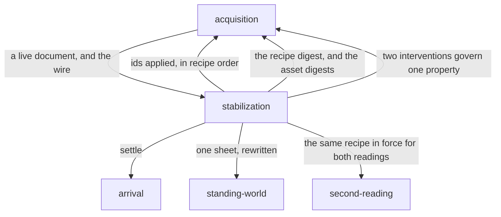

# Stabilization

«service»

## Responsibility

Holds a **subject** still so it can be read, through an enumerable set of
named interventions that are folded into the identity of what they produced.

## Bounded context

[Stability](../../DOMAIN.md#stability)

## Inputs and outputs

In: a recipe — any list of interventions, each carrying an id, the tier that
can observe what it fixes, the property it governs, why it is applied, and how
it is applied; a live document; and the request stream the page is being fed.

Out: the page held still, the ids actually applied in recipe order, a
**stabilization recipe** digest for the **renderer identity**, the interventions
that govern one property between them, and the digests of the assets the wire
served — including those served as the blank they became rather than as the
bytes they were.

## Depends on

- [`arrival`](../arrival/README.md) — the settle steps of a recipe wait for a
  subject to finish appearing, not merely to paint

## Used by

- [`second-reading`](../second-reading/README.md) — two readings of one world
  are only comparable if the same recipe was in force for both
- [`standing-world`](../standing-world/README.md) — the injected sheet is
  rewritten rather than appended, so one document serving many subjects
  accumulates one sheet

## Boundary

An intervention is a value, not a switch: the set is open, so a project with a
need nobody anticipated composes its own rather than forking a struct of
booleans. Two interventions may express one intent through different mechanisms
and stay separate values, because they produce different images and choosing
between them is the caller's business. Two interventions governing one property
are **reported**, never silently resolved.

The damage is taken as far from the product as it can be. Injected CSS and
browser screenshot options come first — nothing in the product imports them and
deleting this deletes the intervention; a contract the subject implements is
real design damage and is reserved
for what the outside genuinely cannot know. Each is scoped to the tier that can
observe what it fixes, so a reader with no layout engine waits for nothing.

A page is held still before it is *read*, not only before it is painted: an
animation in flight is a computed style value and reaches the cheap
representation too.

Nothing here is a mask. An unstable region is not painted over after the fact:
an asset the run is not asserting on is replaced on the wire, at the original's
intrinsic dimensions, so every box resolves as it would have; an image whose
header cannot be read is served unmodified with a diagnostic rather than
blanked at a guessed size, because a fabricated layout is a red run nobody can
explain. What a request cannot know — which element wanted it, what role it
carries, what box it fills — is not guessed here.

The recipe changes identity rather than changing a **verdict**. A baseline read
untouched and one read held still are two baselines, so a run under a different
recipe is **incomparable** instead of presenting the intervention as a
regression. The injected sheet marks itself and is skipped by the collector, so
the tool's own rules never enter a capture, never match a node, and never
appear in anybody's attribution.

## Implementation coordinates

- `packages/core/src/format/intervention.ts` — the `Intervention` value: id,
  `needs` tier, `governs` property, `because`, and one of css, screenshot
  options or a settle step.
- `packages/core/src/format/stabilize.ts` — the vocabulary and the recipes
  (`holdAnimations`, `pinAnimations`, `hideCaret`, `hideScrollbars`,
  `hidePresentationalImages`, `waitForFonts`, `waitForImages`;
  `SEMANTIC_RECIPE`, `LAYOUT_RECIPE`, `RASTER_RECIPE`, `COLLECT_RECIPE`), plus
  `forTier`, `conflicts`, `settleRecipe` and `recipeDigest` — sorted, so
  composition order does not change identity.
- `packages/dom/src/stabilize.ts` — `stabilizeForObservation` and
  `STABILIZE_ATTRIBUTE`: one idempotent sheet, applied before the settle steps,
  left in place between subjects because removing it restarts every animation.
- `packages/playwright/src/network.ts` — routing as an intervention and as a
  reading: asset bodies hashed into the environment inputs, requests asked for
  and not yet answered counted as the honest version of *the images have loaded*.
- `packages/playwright/src/blank.ts` — `BlankRule` and `blankPng`: a rule with
  no matcher is refused rather than read as *everything*.
- `packages/playwright/src/gif.ts` — the first frame of an animated image, as a
  prefix of the original bytes, before the browser decodes anything.

## Diagram

