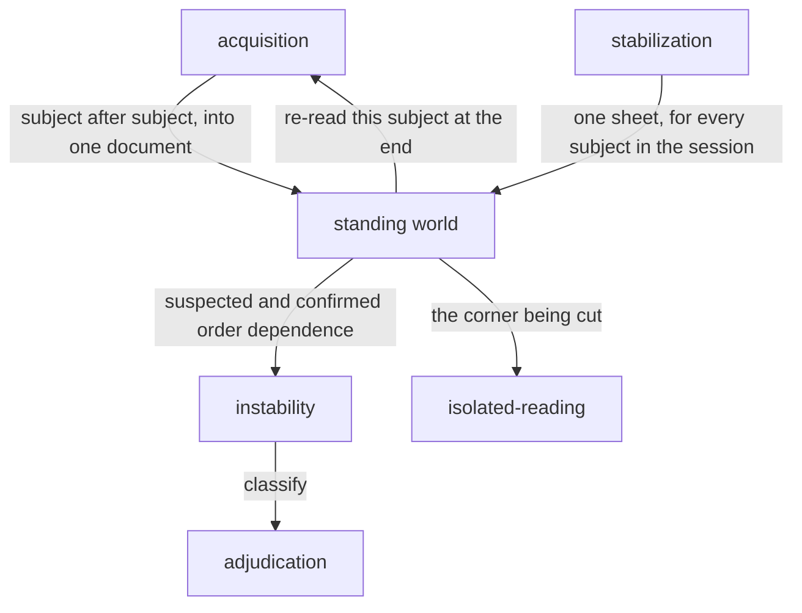

# Standing world

«service»

## Responsibility

Runs many **subjects** in one world that is never torn down between them, and
makes the cross-pollution that buys detectable and attributable rather
than impossible.

## Bounded context

[Stability](../../DOMAIN.md#stability)

## Inputs and outputs

In: a sequence of subjects to read into one document, and the captures and
snapshots each of them produced.

Out: per subject, what it wrote to shared state and what it read from it; and,
at the end, findings — a victim, a culprit where one is derivable, the shared
key that connects them, the evidence sentence, the remedy, and the components
the culprit rendered, so an accusation names a file rather than a story.

## Depends on

- [`stabilization`](../stabilization/README.md) — one idempotent sheet across
  the whole session, since removing it between subjects restarts every animation
- [`instability`](../instability/README.md) — the vocabulary a confirmed
  order-dependence is stated in

## Used by

- [`isolated-reading`](../isolated-reading/README.md) — the corner this cuts is
  the one that pass exists to audit
- [`instability`](../instability/README.md) — suspected and confirmed order
  dependence, to be named by component and band

## Boundary

Isolation is not paid per subject. Constructing a document per test file,
launching a browser per subject, reloading a frame between stories and
re-parsing a design system's stylesheet every time are the costs nobody counts,
and they are paid once here. The leak that buys — a stylesheet one subject
injects, a theme class left on the root, an unmounted portal keeping a node in
the body — is therefore possible, and so it is made visible instead of
prevented.

Detection is two tiers and they are not redundant. Suspicion is free and always
on: a cheap probe diffed around each subject says what it wrote, its own capture
says what it read, and a later subject reading what an earlier one wrote is the
tier that names a culprit. Confirmation is sampled and opt-in: re-running
subjects at the end and comparing against the first hash each produced is proof
that needs no inference, and on its own says a subject is unstable without
saying who made it so. Suspicion without confirmation over-reports;
confirmation without suspicion cannot attribute.

Every resolution in the read set runs toward over-reporting a read, including
rules that merely matched rather than won: a read that is missed is a silently
order-dependent baseline, which is the same class of failure as a false
*unchanged*, while a read that is invented costs one suspicion the empirical
pass then clears.

The probe photographs and does not measure. It reads sheets, root custom
properties, root and body attributes, stray body children and the title, and
not computed style. Every accusation is derived from the record alone — no document,
no re-render — because a detector able to touch the world it is judging could
change it, and a diagnosis that perturbs its own evidence is not one. The first
hash a subject produced is kept and never overwritten, or every subject would
agree with its most recent self and confirm nothing.

## Implementation coordinates

- `packages/session/src/session.ts` — the standing world, and the two paths
  through it.
- `packages/session/src/state.ts` — the probe, its `StateKey` addresses in a
  form legible without a decoder, and `SheetRegistry`, which keys a stylesheet
  by its owner node so inserting one does not renumber the rest.
- `packages/session/src/reads.ts` — `readsOf`: matched rules, resolved custom
  properties, and the inherited floor arriving from outside the subtree.
- `packages/session/src/ledger.ts` — one run per subject, the first hash, the
  evidence per key, and the end-of-session attribution.
- `packages/session/src/findings.ts` — the wording of an accusation, held where
  it cannot reach the record and quietly re-derive one.

## Diagram

